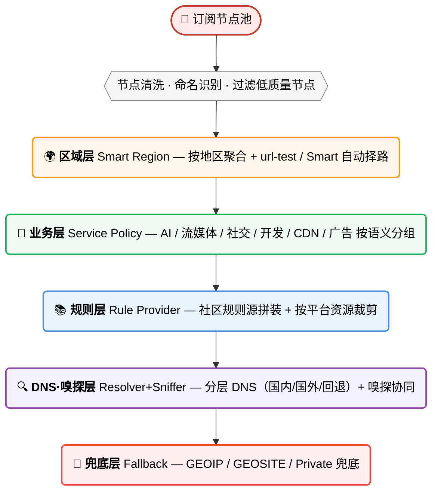
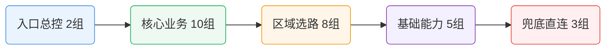

# 🚀 科学上网智能分流配置中心

> [!IMPORTANT]
> **📦 2026-04-23 文件重命名公告**（存量订阅用户必读）
>
> 为统一命名规范，仓库所有主配置文件统一为 **`APP名称(内核名称).扩展名`** 格式（专有引擎的 APP 省略括号）。**如果你用 GitHub Raw URL 订阅，必须更新订阅链接**，否则旧 URL 会 404。
>
> <details>
> <summary>🔽 展开查看 16 处旧名 → 新名对照表</summary>
>
> | 子目录 | 旧名 | 新名 |
> |---|---|---|
> | `Clash Party/` | `Clash Smart内核覆写脚本.js` | `ClashParty(mihomo-smart).js` |
> | `Clash Party/` | `Clash 普通内核覆写脚本.js` | `ClashParty(mihomo).js` |
> | `Clash Meta For Android/` | `clash-smart-cmfa.yaml` | `CMFA(mihomo).yaml` |
> | `OpenClash/` | `openclash_custom_overwrite_full.sh` | `OpenClash(mihomo-smart).sh` |
> | `OpenClash/` | `openclash_custom_overwrite_normal.sh` | `OpenClash(mihomo).sh` |
> | `OpenClash/` | `clash-smart-openclash.conf` | `OpenClash(mihomo).conf` |
> | `Shadowrocket/` | `shadowrocket-smart.conf` | `Shadowrocket.conf` |
> | `SingBox/` | `singbox-smart.json` | `SingBox(sing-box).json` |
> | `SingBox/` | `singbox-smart-full.json` | `SingBox(sing-box)-full.json` |
> | `SingBox/` | `generate-singbox-full.js` | `SingBox(sing-box)-generator.js` |
> | `v2rayN/` | `v2rayn-smart-xray-routing.json` | `v2rayN(xray).json` |
> | `Surge/` | `surge-smart.conf` | `Surge.conf` |
> | `Loon/` | `loon-smart.conf` | `Loon.conf` |
> | `Quantumult X/` | `qx-smart.conf` | `QuantumultX.conf` |
> | `Passwall2/` | `passwall2-smart-shunt.conf` | `Passwall2(xray+sing-box).conf` |
> | `Passwall2/` | `apply-shunt-rules.sh` | `Passwall2(xray+sing-box)-apply.sh` |
>
> **没改名的**：`Passwall2/shunt-rules/*.list`（28 个规则清单，本身编号+分类命名已清晰）、所有 `README.md` / `CHANGELOG.md`。
>
> **迁移方式**：
> - Clash Verge Rev / CMFA / ClashMi / Mihomo Party 等订阅用户 → 把旧订阅 URL 里的文件名段替换为新名
> - OpenClash / Passwall2 / v2rayN 等 SSH 或本地导入用户 → 重新下载新文件或 `git pull`
> - Shadowrocket / Surge / Loon / Quantumult X 等 iCloud + URL 订阅用户 → 删掉旧订阅再用新 URL 导入
>
> </details>

> [!TIP]
> 一套以 **Clash Party（Mihomo Smart 内核）JS 覆写脚本** 为基线、同步产出多核心 / 多客户端等价配置的科学上网分流体系，**同一套策略模型覆盖多端**，让同一套分流策略在任何设备、任何代理工具上给出**一致、可解释、可迭代**的结果，降低“设备 A 可用、设备 B 抽风”的割裂感。  
> - **覆盖核心**：**Mihomo (Clash.Meta / Smart)** · **sing-box** · **Xray** · **Shadowrocket / Surge / Loon / Quantumult X 各自私有引擎**  
> - **覆盖客户端**：**Clash Party / Clash Verge Rev / Mihomo Party / CMFA / FlClash / mihomo-party-android / ClashMi / OpenClash / PassWall2 / Shadowrocket / Surge / Loon / Quantumult X / sing-box / Hiddify / v2rayN**  
> - **覆盖设备**：**Windows / macOS / Linux / Android / iOS / OpenWrt 软路由**
> - 🧩 **精细分流**：按业务语义拆分策略组，避免“大一统代理”带来的误伤与浪费。
> - ⚡ **内核可切换**：OpenClash 提供 Smart / Normal 双版本（同规则量），按内核能力选择 `smart` 或经典 `url-test` 选路。
> - 🤖 **AI 原生仓库**：全部脚本与配置由 AI 编写并持续维护迭代——版本演进 / 结构整理 / 文档优化全由 AI 执行，坚持可读性优先（能跑 + 好懂 + 好改 + 好排障）与平台一致性（同类业务在不同客户端表现一致）。
> - 💬 **Issue 自动回答**：[开 issue](https://github.com/ivansolis1989/Smart-Config-Kit/issues/new/choose) 会触发 AI 自动回答（`/ai-help` 或追问会升级深度推理分析），维护者人工兜底，AI 回复机器人无代码修改权限。
> - ✅ 想要“可追踪”的升级体验，这种 AI 驱动仓库会更适合长期使用。
> - ⚠️ 除 Mihomo 内核由本人实际使用，其他内核未经实测，请测试后使用并积极反馈。

---

## 🧭 分流策略设计框架（重点）



每一层只做一件事，上层稳定下层就稳定——订阅换了、机场改了、规则上游变了，只影响**对应那一层**，不会全链路翻车。

---

## 🧩 Smart 分流规则：28 代理组速览

为了让结构更清晰，下面用“**分层卡片 + 关系图**”展示 28 个代理组，而不是单一大表。



### 🗂️ 代理组与主要 Rule-Providers 对照（Clash Party 实际 28 业务组）

> 只列“主要/高频命中”项，并标明规则来源仓库；不再混入节点组（HK/US/全球节点等）。

| 代理组（与脚本一致） | 主要 rule-providers（示例） | 主要来源仓库 |
|---|---|---|
| 🤖 AI 服务 | `openai` `claude` `gemini` `copilot` `szkane-ai` `acc-copilot` | MetaCubeX / blackmatrix7 / szkane / Accademia |
| 💰 加密货币 | `cryptocurrency` `binance` `szkane-web3` | blackmatrix7 / szkane |
| 🏦 金融支付 | `paypal` `stripe` `visa` `tigerfintech` `acc-bank-*` `acc-vf-*` | blackmatrix7 / Accademia |
| 📧 邮件服务 | `mail` `mailru` `protonmail` `spark` | blackmatrix7 |
| 💬 即时通讯 | `telegram` `telegram-ip` `discord` `whatsapp` `line` `kakaotalk` `acc-signal` | MetaCubeX / blackmatrix7 / Accademia |
| 📱 社交媒体 | `twitter` `twitter-ip` `tiktok` `facebook` `instagram` `snapchat` `reddit` | MetaCubeX / blackmatrix7 |
| 🧑‍💼 会议协作 | `zoom` `slack` `teams` `atlassian` `notion` `remotedesktop` `acc-rustdesk` | ACL4SSR / blackmatrix7 / Accademia |
| 📺 国内流媒体 | `bilibili` `iqiyi` `youku` `tencentvideo` `douyin` `neteasemusic` | blackmatrix7 |
| 📺 东南亚流媒体 | `viu` `biliintl` `iqiyiintl` `wetv` `viki` `acc-kwai` | blackmatrix7 / Accademia |
| 🇺🇸 美国流媒体 | `youtube` `netflix` `netflix-ip` `spotify` `disney` `hulu` `primevideo` | MetaCubeX / blackmatrix7 / szkane |
| 🇭🇰 香港流媒体 | `mytvsuper` `tvb` `encoretvb` `nowe` `rthk` `szkane-bilihmt` | blackmatrix7 / szkane |
| 🇹🇼 台湾流媒体 | `bahamut` `kktv` `litv` `hamivideo` `linetv` `friday` | blackmatrix7 |
| 🇯🇵 日韩流媒体 | `abema` `dazn` `dmm` `tver` `niconico` `rakuten` | blackmatrix7 |
| 🇪🇺 欧洲流媒体 | `bbc` `itv` `all4` `my5` `skygo` `britboxuk` `szkane-uk` | MetaCubeX / blackmatrix7 / szkane |
| 🕹️ 国内游戏 | `steamcn` `wanmeishijie` `wankahuanju` `majsoul` | blackmatrix7 |
| 🎮 国外游戏 | `steam` `epic` `playstation` `xbox` `riot` `ea` `hoyoverse` | blackmatrix7 |
| 🔍 搜索引擎 | `google` `google-ip` `googlesearch` `bing` `scholar` `yandex` | MetaCubeX / blackmatrix7 |
| 📟 开发者服务 | `github` `docker` `gitlab` `python` `developer` `szkane-developer` | blackmatrix7 / szkane |
| Ⓜ️ 微软服务 | `onedrive` `microsoft` `microsoftedge` `acc-microsoftapps` | blackmatrix7 / Accademia |
| 🍎 苹果服务 | `apple` `icloud` `appstore` `appletv` `applemusic` `acc-apple` `acc-applenews` | blackmatrix7 / Accademia |
| 📥 下载更新 | `googlefcm` `systemota` `download` `ubuntu` `mozilla` `android` `acc-macappupgrade` | blackmatrix7 / Accademia |
| ☁️ 云与CDN | `cloudflare` `cloudflare-ip` `cloudfront-ip` `fastly-ip` `akamai` `acc-fastly` | MetaCubeX / blackmatrix7 / Accademia |
| 🛰️ BT/PT Tracker | `privatetracker` `acc-emuleserver` | blackmatrix7 / Accademia |
| 🏠 国内网站 | `cn` `cn-ip` `acc-geositecn` `acc-chinamax` `acc-china` `acc-geo-d-asia-china` | MetaCubeX / blackmatrix7 / Accademia |
| 🚫 受限网站 | `loyalsoldier-gfw` `loyalsoldier-greatfire` `szkane-proxygfw` | Loyalsoldier / szkane |
| 🌐 国外网站 | `proxy` `cnn` `nytimes` `bloomberg` `ebay` `wikipedia` `acc-waybackmachine` | blackmatrix7 / Accademia / szkane |
| 🐟 漏网之鱼 | 以 GEOSITE/GEOIP/FINAL 兜底为主（非单一固定 provider） | MetaCubeX（geo 规则） |
| 🛑 广告拦截 | `anti-ad` `sukka-phishing` `hagezi-tif` `advertising` `privacy` `acc-unsupportvpn` | DustinWin / SukkaW / Hagezi / blackmatrix7 / Accademia |

---

## 🎯 差异化价值：补充 rule-provider 相对 `geosite.dat` + `geoip.dat` 的差异

> 本仓库在 MetaCubeX `geosite.dat` + Loyalsoldier `geoip.dat` 基础上叠加了 ~300 个补充 rule-provider。这一节解释**为什么需要它们**——以及**每一条必须回答"我比原生 dat 多解决了什么"**，不是数量游戏。
>
> 代理组嵌套 / Smart / LightGBM 等架构能力是另一回事，见上一章「🧩 Smart 分流规则」。

### 匹配层的两个维度

| 维度 | 裸用 `geosite.dat` + `geoip.dat` | 本仓库 |
|---|---|---|
| **域名分类** | ~500 个扁平分类 | 继承全部 + ~300 个补充（填下方 4 类空白） |
| **IP 分类** | 50+ 国家码 + 15 服务标签（`cloudflare` / `telegram` / `netflix` / `google` / `facebook` / `fastly` …） | **直接用原生 Loyalsoldier，0 增量**——这个维度不造轮子 |

### 300 个补充 rule-provider，分 4 类填空白

每条 rule-provider 必须归入下方 4 类之一，否则拒绝加。

---

#### ① 新兴服务：geosite 收录滞后 2–4 周

**问题**：新 AI / Web3 / 冷门工具刚上线时不在 geosite 里，请求 fall through 到 FINAL 走错节点。

**补充**：`szkane-ai` / `acc-grok` / `acc-copilot` + 手工 `domain-suffix:`——

`cursor.com` · `v0.dev` · `character.ai` · `mistral.ai` · `perplexity.ai` · `pi.ai` · `midjourney.com` · `runpod.io` · `openrouter.ai` · CiciAI · 新 Web3 DEX …

**效果**：新服务上线当天就能正确路由，不用等 geosite 更新。

---

#### ② 拆 geosite 总类：让子服务独立决策

**问题**：`geosite:apple` 是一个总类，所有 Apple 子服务只能共享同一策略——想做到"AppStore 直连、TestFlight 走美国、AppleMusic 代理解锁"做不到。

**补充**：bm7 的 Apple 家族拆成 12 个独立 rule-provider：

| 子类 | 建议出站 |
|---|---|
| `apple` / `icloud` 主类 | 直连 |
| `appstore` / `applefirmware` | 直连（省带宽，固件几 GB） |
| `applemusic` / `appletv` / `testflight` | 代理（解锁境外订阅 / beta） |
| `siri` / `applenews` / `appledev` / `findmy` / `appleproxy` | 代理（国区阉割）|

**效果**：下 Xcode 直连、开 TestFlight 走 US、切 Apple Music 境外歌单——一套配置自动区分。Google / Microsoft 家族同理。

---

#### ③ 广告拦截：多源纵深覆盖不同威胁类型

**问题**：`geosite:category-ads-all` 只管「广告」一类，**钓鱼 / 恶意软件 / 隐私追踪 / 国内 SDK 埋点 / DNS 劫持** 全都不在。

**补充**：🛑 广告拦截组下 9 个来源互补（不是重复加码）——

| 来源 | 覆盖威胁 |
|---|---|
| `anti-ad`（DustinWin） | 国内外广告联盟（5 万+） |
| `sukka-phishing`（SukkaW） | 钓鱼域名（13 万+） |
| `hagezi-tif`（Hagezi） | 威胁情报：malware / C2 / cryptojacking / scam |
| `acc-hijackingplus`（Accademia） | 运营商 DNS 劫持 + HTTP 302 注入 |
| `acc-blockhttpdnsplus` | HTTP DNS SDK 绕系统 DNS |
| `acc-prerepaireasyprivacy` | 隐私追踪：FB Pixel / GA / Mixpanel |
| `miuiprivacy` / `jiguangtuisong` / `youmengchuangxiang` | 国内 SDK 埋点（小米 / 极光 / 友盟）|
| `category-ads-all`（geosite） | 兜底 |

**效果**：访问假冒币安登录页 → `sukka-phishing` 拦下；小米手机每天几千条 REJECT 阻止国内 SDK 上报。

---

#### ④ 地区长尾 / 特殊 ASN：geosite 不维护的小众

**问题**：geosite 是国际社区维护，不收录中国特有 SDK / 地区细分 / IoT 专用 ASN。

**补充**：

| provider | 用途 |
|---|---|
| `szkane-uk` | 英国流媒体细分（geosite:bbc / itv 覆盖不全） |
| `szkane-bilihmt` | B 站港澳台版（geosite 只有 bilibili + biliintl 两总类） |
| `acc-aqara-cn` | 绿米 IoT 国内端点（普通 geosite:cn 不含 IoT ASN） |
| `acc-homeip-us` / `acc-homeip-jp` | 美日住宅 IP 段识别（geoip.dat 只到国家级） |

---

### 加法原则：拒绝无脑堆砌

| 场景 | 判定 | 理由 |
|---|:-:|---|
| 和 geosite 某分类 > 95% 重叠 | ❌ 拒绝 | 纯冗余。v5.2.5 据此删 `acc-geositecn` / `acc-china` |
| 和已有 rule-provider 逐条重复但无新条目 | ❌ 拒绝 | 同上 |
| 填补新兴服务（类 ①） | ✅ 通过 | |
| 拆 geosite 总类为子类（类 ②） | ✅ 通过 | |
| 多源互补覆盖不同威胁（类 ③） | ✅ 通过 | |
| 地区长尾 / 特殊 ASN（类 ④） | ✅ 通过 | |
| geosite 里叫法不同的别名映射（如 `snap` vs `snapchat`） | ⚠️ 有条件 | 修 bug 不加条目 |

> **小结**：本仓库的匹配层增量 = 新兴服务 + 子类拆分 + 广告多源纵深 + 地区长尾 ASN。原生 geosite / geoip 能覆盖的部分一律不重复造轮子。

---

## 🛡️ DNS 净化：科学上网的第一道防线

> 分流规则配得再好，**DNS 漏了照样白搭**。这一节解释为什么 DNS 在科学上网里是"基石"，并给出本仓库的推荐配置（完整 YAML 见 `Clash Party/README.md` 第四章 DNS 段）。

### 为什么 DNS 比节点协议更重要？

科学上网的三个主要敌人——**GFW / ISP / 机场节点封控**——**全都从 DNS 层下手**，早于节点握手：

| 威胁 | 常见手法 | 没做 DNS 净化的后果 |
|---|---|---|
| **GFW DNS 污染** | 对敏感域名（google/youtube/telegram/github…）的明文 DNS 查询返回假 IP | 浏览器拿到假 IP → 走代理组里的节点也打不通（因为 IP 是假的）|
| **ISP DNS 劫持** | 你的 53 端口 UDP 包被运营商拦截 → 返回广告页或空白 | 机场节点域名解析失败；`jsdelivr.net` 冷启动下载规则失败 |
| **运营商流量审计** | 通过明文 DNS 记录你访问了哪些域名（即便流量本身加密）| 上网日志被运营商完整记录；风控系统据此限速或约谈 |
| **机场节点 IP 暴露** | 解析 `node.xxx-airport.com` 的 DNS 查询走 ISP → ISP 知道你"经常解析一个特定 VPS 域名" | 机场节点 IP 被针对性封禁；切换新节点没用（运营商封域名不封 IP）|
| **DNS 缓存污染** | 本地或上游 DNS 缓存了错的结果 | 机场节点切 IP 后你还在走旧 IP；解锁流媒体时 CDN 选错 |

**结论**：DNS 是整个代理链路里**最容易被在不加密的情况下植入侧信道**的一环。加密 DNS（DoH / DoT）不是可选项，是**必选项**。

### 本仓库的 DNS 四层分工

Clash Party / CMFA / OpenClash 都采用同一套分层方案（详见 `Clash Party/README.md` 第四章的完整 YAML）：

```
┌─────────────────────────────────────────────────────────────────┐
│  ① default-nameserver（明文 UDP，仅用于 bootstrap）              │
│     223.5.5.5 / 119.29.29.29 / 1.1.1.1 / 8.8.8.8                │
│     作用：启动时解析下面那些 DoH URL 的域名（dns.alidns.com 等）   │
│     只查 4 个 IP，不参与任何业务查询 → 零暴露面                    │
└──────────────┬──────────────────────────────────────────────────┘
               │ bootstrap 成功后，所有业务查询全走加密 DoH：
               ▼
┌─────────────────────────────────────────────────────────────────┐
│  ② nameserver（国内域名主通道，DoH）                              │
│     https://223.5.5.5/dns-query     (AliDNS)                    │
│     https://doh.pub/dns-query        (DNSPod / Tencent)         │
│     作用：大陆站点 / 国内 CDN 用国内权威 DoH → 不被 ISP 记录       │
├─────────────────────────────────────────────────────────────────┤
│  ③ proxy-server-nameserver（机场节点域名解析，DoH）               │
│     https://1.1.1.1/dns-query       (Cloudflare)                │
│     https://8.8.8.8/dns-query       (Google)                    │
│     https://223.5.5.5/dns-query     (AliDNS)                    │
│     https://doh.pub/dns-query       (DNSPod)                    │
│     作用：解析 node.xxx-airport.com 时走海外 DoH → 机场节点       │
│           域名和 IP 都不暴露给 ISP，也不被 DNS 污染               │
├─────────────────────────────────────────────────────────────────┤
│  ④ fallback（海外域名回退通道，DoH + GeoIP 解毒）                 │
│     https://1.1.1.1/dns-query + https://8.8.8.8/dns-query       │
│     fallback-filter.geoip-code: CN                              │
│     作用：国外域名若查出 CN 段 IP（说明被污染），自动用 fallback    │
│           重查 → 避开 GFW 注入的假 IP                            │
└─────────────────────────────────────────────────────────────────┘
```

### 为什么这套分工能同时解决 5 个威胁

| 威胁 | 本方案如何化解 |
|---|---|
| GFW DNS 污染 | ① ~ ④ 全部走 DoH（TLS 加密），GFW 看不到 DNS 内容更注入不了；④ 的 `fallback-filter.geoip-code: CN` 再做一次"看到 CN IP 就切换上游"的解毒逻辑 |
| ISP DNS 劫持 | 53 端口只用于 bootstrap 那 4 个 IP，业务查询 **100% 走 443 DoH**；ISP 连 SNI 都看不到（Cloudflare / 阿里 DNS 的 ECH/CECPQ 进一步加密） |
| 运营商流量审计 | DoH 走 HTTPS 443，和正常网页流量外观一致；运营商**不能区分**你在查 DNS 还是刷网页 |
| 机场节点 IP 暴露 | ③ `proxy-server-nameserver` 让节点域名解析走海外 DoH，ISP 完全不知道你连过这个机场 |
| DNS 缓存污染 | fake-ip 模式下本地不缓存真实 IP（每次查询返回 198.18.x.x 假 IP，由 mihomo 实时映射真实出站）；节点切 IP 后**立刻生效**，无缓存延迟 |

### 推荐做法

1. **首选加密 DoH**。不要用明文 UDP DNS（`114.114.114.114` / `8.8.8.8` 直连 53）——`114.114.114.114` 在大陆运营商会做劫持，`8.8.8.8` 会被 GFW 污染 + ISP 看到你在用海外 DNS。
2. **国内 DoH 建议用 AliDNS + DNSPod 组合**（`https://223.5.5.5/dns-query` + `https://doh.pub/dns-query`）。两家都是中国合规 DoH，在 443 端口的 TLS 流量里 ISP 无法区分。
3. **海外 DoH 建议用 Cloudflare + Google**（`https://1.1.1.1/dns-query` + `https://8.8.8.8/dns-query`）。Cloudflare 额外支持 ODoH / ECH，隐私更好。
4. **`proxy-server-nameserver` 必须单独配置**（容易忽略）。这是解决"机场节点 IP 被针对性封"的关键——让机场节点域名的解析也走海外 DoH 而不是默认通道。
5. **fake-ip 模式强烈推荐**（`enhanced-mode: fake-ip`）。比 redir-host 快 + 无本地缓存污染 + 规则命中更精准。
6. **别在 `hosts:` 里写业务域名**。`hosts:` 只适合给 bootstrap DoH（例如 `one.one.one.one → 1.1.1.1`）写兜底 IP，用来规避 DNS 冷启动死锁；写业务域名会让本配置的规则命中失效。

### 怎么验证 DNS 真的净化了

```bash
# 1) 检查是否泄漏 DNS（浏览器里访问）
https://dnsleaktest.com          # 应只显示你配置的 DoH 上游，不应看到 ISP DNS
https://whoami.cloudflare.com    # 应显示 Cloudflare DoH

# 2) 命令行直接测 DoH 可达
curl -H 'accept: application/dns-json' \
  'https://doh.pub/dns-query?name=google.com&type=A'
# 成功 = 返回 JSON（含 Answer 字段）

# 3) 抓包确认查询走 443（不是 53）
tcpdump -n -i any port 53        # 应只看到 bootstrap 的 4 个 IP 被查一次
tcpdump -n -i any port 443       # 应看到持续流量 → DoH 正常
```

### 各端配置要点（跳过手动配的对照）

| 端 | DNS 段已内置 | 用户要做的 |
|---|:-:|---|
| Clash Party / Verge / Mihomo Party | ❌（脚本不注入 DNS，需粘到 UI Mixin） | 把 `Clash Party/README.md` 第四章的 DNS YAML 粘到客户端 Mixin / 合并字段 |
| CMFA / FlClash | ✅（已写在 YAML 里） | 无 |
| OpenClash Smart / Normal | ✅（脚本已注入） | 无 |
| Shadowrocket | ✅（`.conf` 已含 DoH 字段） | iOS 15+ 即可，不需额外操作 |
| Surge / Loon / QX | ✅（`.conf` 已含 DoH） | 无 |
| SingBox / Hiddify / HomeProxy | ✅（JSON 已含 DoH server） | 无 |
| v2rayN（mihomo 核）| ✅（吃 CMFA YAML） | 在 v2rayN 设置里勾选"使用配置文件里的 DNS 设置" |
| v2rayN（sing-box / Xray 核）| ⚠️ | 参见 `v2rayN/README.md` |

---

## 🔌 各端协议支持 + 快速导入速查

一张表搞定："**机场给什么协议 → 选哪个端 → 去哪看教程**"。列名缩写 + 具体配置文件 → 见表下方。

| 协议 | Clash<br>Party | CMFA | Open<br>Clash | Shadow<br>rocket | Surge | Loon | QX | sing-<br>box | v2rayN<br>Xray | v2rayN<br>mihomo |
|---|:-:|:-:|:-:|:-:|:-:|:-:|:-:|:-:|:-:|:-:|
| **SS (+ 2022)** | ✅ | ✅ | ✅ | ✅ | ✅ | ✅ | ✅ | ✅ | ✅ | ✅ |
| **SSR** | ✅ | ✅ | ✅ | ✅ | ❌ | ✅ | ✅ | ❌ | ❌ | ✅¹ |
| **VMess** | ✅ | ✅ | ✅ | ✅ | ✅ | ✅ | ✅ | ✅ | ✅ | ✅ |
| **VLESS** | ✅ | ✅ | ✅ | ✅ | ❌ | ✅ | ⚠️ | ✅ | ✅ | ✅ |
| **REALITY + Vision** | ✅ | ✅ | ✅ | ✅ | ❌ | ✅ | ⚠️ | ✅ | ✅ | ✅ |
| **Trojan** | ✅ | ✅ | ✅ | ✅ | ✅ | ✅ | ✅ | ✅ | ✅ | ✅ |
| **Hysteria 1** | ✅ | ✅ | ✅ | ✅ | ❌ | ✅ | ❌ | ✅ | ❌ | ✅ |
| **Hysteria 2** | ✅ | ✅ | ✅ | ✅ | ⚠️² | ✅ | ❌ | ✅ | ❌ | ✅ |
| **TUIC v5** | ✅ | ✅ | ✅ | ✅ | ❌ | ✅ | ❌ | ✅ | ❌ | ✅ |
| **WireGuard** | ✅ | ✅ | ✅ | ✅ | ✅ | ✅ | ❌ | ✅ | ⚠️ | ✅ |
| **AnyTLS** | ✅ | ✅ | ✅ | ✅ | ❌ | ⚠️ | ❌ | ✅ | ❌ | ✅ |
| **ShadowTLS** | ✅ | ✅ | ✅ | ✅ | ❌ | ⚠️ | ❌ | ✅ | ❌ | ✅ |
| **Snell v4** | ✅ | ✅ | ✅ | ✅ | ✅ | ✅ | ❌ | ❌ | ❌ | ✅¹ |
| **Mieru** | ✅ | ✅ | ✅ | ⚠️ | ❌ | ❌ | ❌ | ❌ | ❌ | ✅¹ |
| **SSH 出站** | ✅ | ✅ | ✅ | ❌ | ❌ | ❌ | ❌ | ✅ | ❌ | ✅ |
| **HTTP / SOCKS5** | ✅ | ✅ | ✅ | ✅ | ✅ | ✅ | ✅ | ✅ | ✅ | ✅ |
| **LightGBM 自动择优** | ✅³ | ❌ | ✅ | ❌ | ❌ | ❌ | ❌ | ❌ | ❌ | ❌ |
| **📖 子目录** | [Clash Party](./Clash%20Party/) | [CMFA](./Clash%20Meta%20For%20Android/) | [OpenClash](./OpenClash/) | [Shadow<br>rocket](./Shadowrocket/) | [Surge](./Surge/) | [Loon](./Loon/) | [QX](./Quantumult%20X/) | [SingBox](./SingBox/) | [v2rayN](./v2rayN/) | [v2rayN](./v2rayN/) |

> ✅ 原生支持 · ⚠️ 部分 / 新版本才有 · ❌ 不支持
> ¹ 需 v2rayN 切到 mihomo 核心 · ² Surge 5.9+ 才有 · ³ 需 mihomo Smart Alpha + JS 覆写

**🏷️ 客户端列名缩写对照**：
- **Clash Party** = Clash Party / Clash Verge Rev / Mihomo Party
- **CMFA** = Clash Meta For Android / FlClash / mihomo-party-android / **[ClashMi](https://github.com/KaringX/clashmi)**（KaringX 跨平台 Flutter GUI，iOS/macOS/Android/Windows/Linux，同样 bundle MetaCubeX mainline，直接复用 `CMFA(mihomo).yaml`；导入流程与差异点见 [CMFA 子目录 §九](./Clash%20Meta%20For%20Android/README.md#九兼容客户端clashmi跨平台)）
- **QX** = Quantumult X
- **sing-box** = sing-box 通用客户端（SFA / SFM / SFI / Hiddify / NekoBox / Karing / HomeProxy）
- **v2rayN Xray** = v2rayN 默认 Xray 核模式
- **v2rayN mihomo** = v2rayN 切到 mihomo 或 sing-box 核

**📁 具体配置文件**（点击上方 📖 列进对应子目录查看）：
- Clash Party → `ClashParty(mihomo-smart).js`（JS 覆写脚本）
- CMFA → `CMFA(mihomo).yaml`
- OpenClash → `OpenClash(mihomo-smart).sh`（Smart） / `OpenClash(mihomo).sh`（Normal） + `OpenClash(mihomo).conf`
- Shadowrocket → `Shadowrocket.conf`
- Surge → `Surge.conf`
- Loon → `Loon.conf`
- Quantumult X → `QuantumultX.conf`
- SingBox → `SingBox(sing-box)-full.json`
- v2rayN Xray → `v2rayN(xray).json`
- v2rayN mihomo/sing-box → 复用 `Clash Meta For Android/CMFA(mihomo).yaml` 或 `SingBox/SingBox(sing-box)-full.json`

### 一句话决策树
- 机场只给 **SS / VMess / Trojan**：任何客户端都行，**按设备+预算挑**
- 机场主推 **VLESS + REALITY**：Mihomo / sing-box / Shadowrocket / Loon / v2rayN 任选
- 机场主推 **Hysteria 2 / TUIC**：避开 **Surge (旧版) / QX / Xray**；其它都行
- 机场是 **Snell 专用**（Surge 机场）：Shadowrocket / Surge / Loon / Mihomo 系
- 想要 **WireGuard**：除 QX 都行
- 想要 **LightGBM 自动择优**：**只能走 Clash Party / OpenClash** + Mihomo Smart Alpha 内核 + JS 覆写
- 协议 + 价格性价比：**iOS 上 Shadowrocket (¥20)** / **Android 上 CMFA (免费)** / **桌面上 Mihomo Party (免费)** / **软路由上 OpenClash (免费)**
### 软路由用户：已装其它代理插件的对号入座

**对照上面矩阵的列**，按你插件底层内核选：

- **ShellClash**（`juewuy/ShellCrash`，mihomo 核）→ 用 **CMFA 列** 的 `CMFA(mihomo).yaml`
- **HomeProxy**（sing-box 官方 LuCI 插件，sing-box 核）→ 用 **sing-box 列** 的 `SingBox(sing-box)-full.json`
- **Passwall / Passwall2**（[`Openwrt-Passwall`](https://github.com/Openwrt-Passwall) 组织并行维护的两款插件——原 `xiaorouji` 个人仓库已迁入该组织，xray + sing-box 双栈，都**不打包** mihomo，都**没有 proxy-groups 嵌套**）→ 首选**迁移到 OpenClash** 拿完整能力；或保留插件用本仓库 `Passwall2/` 目录的 **28 条 shunt rule 展平参考**（同一份 `.list` Passwall 与 Passwall2 通用，规则语法共用 `shunt_rules.lua`）
- **SSR Plus+**（已停更 + 无 geosite / rule_set 层）→ 直接换 **OpenClash**

> 💡 Passwall 系**能**做 `geosite` / `geoip` / `rule_set` 的规则匹配，**不能**做 mihomo 的「业务组 → 区域组 → 节点」两级 `select` + `url-test` 嵌套。**注意**：Passwall / Passwall2 的 shunt rule **不识别** Clash 的 `DOMAIN-SUFFIX,` / `DOMAIN-KEYWORD,` 前缀，要用 xray/sing-box 原生语法（`domain:` / `full:` / `regexp:` / `geosite:` / `rule-set:remote|local:`）。想要完整的 28+9 架构 + LightGBM + 机场换节点自动归位，只有 mihomo 系（OpenClash / CMFA / ShellClash）能原生给。详细差异见 `Passwall2/README.md`。

---

## 📌 适用人群

- 想“一套配置跑多端”的用户；
- 不想手工维护大量策略组但又追求精细分流的用户；
- 希望借助 AI 持续优化配置工程质量的用户。

---

## 🙏 致谢（上游依赖）

本仓库主要做**编排、覆写、适配与维护**——**真正的重活都是下面这些项目做的**，按类别一行列出：

**🧠 核心代理内核**：[MetaCubeX/mihomo](https://github.com/MetaCubeX/mihomo) / [mihomo Smart Alpha](https://github.com/MetaCubeX/mihomo/tree/Alpha) / [vernesong/LightGBM Model](https://github.com/vernesong/mihomo/releases/download/LightGBM-Model/Model.bin) / [SagerNet/sing-box](https://github.com/SagerNet/sing-box) / [XTLS/Xray-core](https://github.com/XTLS/Xray-core) / [hiddify/hiddify-sing-box](https://github.com/hiddify/hiddify-sing-box)

**📱 客户端**：[mihomo-party](https://github.com/mihomo-party-org/mihomo-party) / [clash-verge-rev](https://github.com/clash-verge-rev/clash-verge-rev) / [ClashMetaForAndroid](https://github.com/MetaCubeX/ClashMetaForAndroid) / [FlClash](https://github.com/chen08209/FlClash) / [OpenClash](https://github.com/vernesong/OpenClash) / [HomeProxy](https://github.com/immortalwrt/homeproxy) / [ShellCrash](https://github.com/juewuy/ShellCrash) / [openwrt-passwall2](https://github.com/Openwrt-Passwall/openwrt-passwall2) / [v2rayN](https://github.com/2dust/v2rayN) / [hiddify-app](https://github.com/hiddify/hiddify-app)

**📚 规则数据库**：[MetaCubeX/meta-rules-dat](https://github.com/MetaCubeX/meta-rules-dat)（geosite） / [Loyalsoldier/geoip](https://github.com/Loyalsoldier/geoip)（geoip + mmdb + asn） / [Loyalsoldier/clash-rules](https://github.com/Loyalsoldier/clash-rules) / [Loyalsoldier/v2ray-rules-dat](https://github.com/Loyalsoldier/v2ray-rules-dat)

**📦 业务规则集**：[blackmatrix7/ios_rule_script](https://github.com/blackmatrix7/ios_rule_script)（主力） / [Accademia/Additional_Rule_For_Clash](https://github.com/Accademia/Additional_Rule_For_Clash) / [DustinWin/ruleset_geodata](https://github.com/DustinWin/ruleset_geodata) / [ACL4SSR](https://github.com/ACL4SSR/ACL4SSR) / [SukkaW/Surge](https://github.com/SukkaW/Surge) / [hagezi/dns-blocklists](https://github.com/hagezi/dns-blocklists) / [MiHomoer/MiHomo-Hagezi](https://github.com/MiHomoer/MiHomo-Hagezi) / [szkane/Rules](https://github.com/szkane/Rules) / [privacy-protection-tools/anti-AD](https://github.com/privacy-protection-tools/anti-AD)

**🛠️ 辅助工具**：[Sub-Store](https://github.com/sub-store-org/Sub-Store) / [KOP-XIAO/QuantumultX](https://github.com/KOP-XIAO/QuantumultX) / [Koolson/Qure](https://github.com/Koolson/Qure) / [v2fly/domain-list-community](https://github.com/v2fly/domain-list-community)

**💳 商业闭源客户端**：[Shadowrocket](https://apps.apple.com/app/shadowrocket/id932747118) / [Surge](https://nssurge.com/) / [Loon](https://apps.apple.com/app/loon/id1373567447) / [Quantumult X](https://apps.apple.com/app/quantumult-x/id1443988620)

**⚠️ 未逐项列出但确实贡献的**：所有向 `v2fly/domain-list-community` + `MaxMind / GeoCN` 提交域名 / IP CIDR 的个人贡献者（数据库真正的脊梁）· Issue / PR 里报告过命中错误 / 节点无法识别 / 规则失效的用户。

> 如果本仓库遗漏了你贡献的上游项目，欢迎开 Issue 指出——**所有真正做事的人都值得被点名**。

## 💖 捐赠 / 给维护者买杯咖啡

本仓库纯个人 + AI 维护，**没广告 / 没商业合作 / 永久免费开源**。如果它帮你省了翻墙调试的时间、让你的 ChatGPT 不再 403、或者拦住过一次钓鱼页，欢迎打赏一杯咖啡 ☕。

<p align="center">
  <!-- TODO: 维护者手动贴入微信收款码图片（建议放到 docs/ 或本仓库任意目录后调整路径）-->
  
  &nbsp;&nbsp;&nbsp;&nbsp;
  <!-- TODO: 维护者手动贴入支付宝收款码图片 -->
  
</p>

<p align="center"><em>左：微信 &nbsp;|&nbsp; 右：支付宝</em></p>

> **打赏完全自愿，不影响任何功能**——本仓库 100% 开源，所有规则 / 配置 / 更新永久免费，不会因是否打赏而有差异。

不方便打赏也能**同等支持**：

- ⭐ **Star 本仓库** 让更多人看见
- 🐛 **开 Issue** 报告命中错误 / 规则失效 / 新机场节点没被识别
- 📝 **PR 贡献** 新兴服务域名补充 / 地区正则修正 / 某个客户端的新字段适配
- 📣 **告诉朋友** "还有一个 AI 全仓维护的科学上网配置"

---

## ⚠️ 免责声明

- 本仓库仅用于网络技术学习与配置研究，不提供任何订阅服务；
- 请遵守你所在地区法律法规；
- 使用本仓库产生的风险需自行评估与承担。

---

## 📄 License

默认采用 **MIT License**。第三方规则与数据资产遵循其各自许可证。
