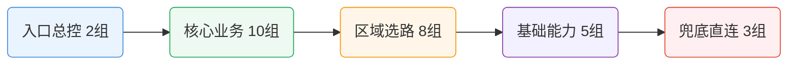

# 🚀 科学上网智能分流配置中心（AI 全仓维护版）

> 一套以 **Clash Party（Mihomo Smart 内核）JS 覆写脚本** 为基线，同步产出多核心 / 多客户端等价配置的科学上网分流体系。  
> 覆盖核心：**Mihomo (Clash.Meta / Smart)** · **sing-box** · **Xray** · **Shadowrocket / Surge / Loon / Quantumult X 各自私有引擎**  
> 覆盖客户端：**Clash Party / Clash Verge Rev / Mihomo Party / CMFA / FlClash / OpenClash / Shadowrocket / Surge / Loon / Quantumult X / sing-box / Hiddify / v2rayN**  
> 覆盖设备：**Windows / macOS / Linux / Android / iOS / OpenWrt 软路由**  
> 目标：让同一套分流策略在任何设备、任何代理工具上给出**一致、可解释、可迭代**的结果。

---

## ✨ 项目亮点（先看这个）

- 🧠 **统一架构**：同一套策略模型覆盖多端，降低“设备 A 可用、设备 B 抽风”的割裂感。
- 🧩 **精细分流**：按业务语义拆分策略组，避免“大一统代理”带来的误伤与浪费。
- ⚡ **性能可控**：OpenClash 提供轻量化方案，兼顾命中率与内存占用。
- 🤖 **AI 原生仓库**：**本仓库全部脚本与配置由 AI 编写，并由 AI 持续维护与迭代**。

---

## 🤖 AI 开发与维护声明

### 本仓库的工程原则

1. **全量 AI 编写**：仓库内脚本/配置以 AI 生成与重构为主。
2. **全量 AI 维护**：版本演进、结构整理、说明文档优化由 AI 持续执行。
3. **可读性优先**：配置不只“能跑”，还要“好懂、好改、好排障”。
4. **平台一致性**：尽量让同类业务在不同客户端表现一致。

> ✅ 如果你希望“可追踪”的升级体验，这种 AI 驱动仓库会更适合长期使用。

---

## 🧭 分流策略设计框架（重点）

下面是这套配置的“架构设计图（文字版）”：

```text
订阅节点池
   ↓（节点清洗 + 命名识别 + 低质量过滤）
区域层（Smart Region Layer）
   ↓
业务层（Service Policy Layer）
   ↓
规则层（Rule Provider Layer）
   ↓
DNS/嗅探层（Resolver + Sniffer Layer）
   ↓
兜底层（Fallback Layer）
```

### 1) 区域层：Smart Region Layer 🌍

通过关键字 + 国家/地区语义识别，把节点聚合到区域组（如 HK / TW / JP / SG / US / EU 等），每组使用智能选优策略（如 `url-test` + Smart 能力）完成自动择路。

**设计意义：**
- 降低手工选节点成本；
- 把“连通性问题”隔离在区域层，业务层不用频繁改。

### 2) 业务层：Service Policy Layer 🧱

以业务语义分组（AI 服务、流媒体、社交、开发、云/CDN、广告拦截等），每个业务组只关心“该走哪类路径”，而不是具体节点名。

**设计意义：**
- 业务行为与物理节点解耦；
- 当订阅供应商变化时，业务组可基本无感迁移。

### 3) 规则层：Rule Provider Layer 📚

依赖社区规则源进行能力拼装，不做无谓重复造轮子；在不同平台按资源约束做裁剪组合。

**设计意义：**
- 命中逻辑可解释；
- 便于跟随上游规则修订。

### 4) DNS/嗅探层：Resolver + Sniffer 🔍

采用分层 DNS（国内/国外/回退）+ 嗅探协同，确保 fake-ip 场景下依然能尽量正确识别目标业务。

**设计意义：**
- 降低 DNS 泄漏风险；
- 提高复杂站点与多域业务命中准确率。

### 5) 兜底层：Fallback Layer 🛟

使用 GEOIP / GEOSITE / Private 等规则做最后防线，保证“未知流量不裸奔、已知流量有归属”。

---

## 🛡️ DNS 净化：科学上网的第一道防线

> 分流规则配得再好，**DNS 漏了照样白搭**。这一节解释为什么 DNS 在科学上网里是"基石"，并给出本仓库的推荐配置（完整 YAML 见 `Clash Party/README.md` 第四章 DNS 段）。

### 为什么 DNS 比节点协议更重要？

科学上网的三个主要敌人——**GFW / ISP / 机场节点封控**——**全都从 DNS 层下手**，早于节点握手：

| 威胁 | 常见手法 | 没做 DNS 净化的后果 |
|---|---|---|
| **GFW DNS 污染** | 对敏感域名（google/youtube/telegram/github…）的明文 DNS 查询返回假 IP | 浏览器拿到假 IP → 走代理组里的节点也打不通（因为 IP 是假的）|
| **ISP DNS 劫持** | 你的 53 端口 UDP 包被运营商拦截 → 返回广告页或空白 | 机场节点域名解析失败；`jsdelivr.net` 冷启动下载规则失败 |
| **运营商流量审计** | 通过明文 DNS 记录你访问了哪些域名（即便流量本身加密）| 上网日志被运营商完整记录；风控系统据此限速或约谈 |
| **机场节点 IP 暴露** | 解析 `node.xxx-airport.com` 的 DNS 查询走 ISP → ISP 知道你"经常解析一个特定 VPS 域名" | 机场节点 IP 被针对性封禁；切换新节点没用（运营商封域名不封 IP）|
| **DNS 缓存污染** | 本地或上游 DNS 缓存了错的结果 | 机场节点切 IP 后你还在走旧 IP；解锁流媒体时 CDN 选错 |

**结论**：DNS 是整个代理链路里**最容易被在不加密的情况下植入侧信道**的一环。加密 DNS（DoH / DoT）不是可选项，是**必选项**。

### 本仓库的 DNS 四层分工

Clash Party / CMFA / OpenClash 都采用同一套分层方案（详见 `Clash Party/README.md` 第四章的完整 YAML）：

```
┌─────────────────────────────────────────────────────────────────┐
│  ① default-nameserver（明文 UDP，仅用于 bootstrap）             │
│     223.5.5.5 / 119.29.29.29 / 1.1.1.1 / 8.8.8.8                │
│     作用：启动时解析下面那些 DoH URL 的域名（dns.alidns.com 等） │
│     只查 4 个 IP，不参与任何业务查询 → 零暴露面                  │
└──────────────┬──────────────────────────────────────────────────┘
               │ bootstrap 成功后，所有业务查询全走加密 DoH：
               ▼
┌─────────────────────────────────────────────────────────────────┐
│  ② nameserver（国内域名主通道，DoH）                              │
│     https://223.5.5.5/dns-query     (AliDNS)                    │
│     https://doh.pub/dns-query        (DNSPod / Tencent)         │
│     作用：大陆站点 / 国内 CDN 用国内权威 DoH → 不被 ISP 记录     │
├─────────────────────────────────────────────────────────────────┤
│  ③ proxy-server-nameserver（机场节点域名解析，DoH）               │
│     https://1.1.1.1/dns-query       (Cloudflare)                │
│     https://8.8.8.8/dns-query       (Google)                    │
│     https://223.5.5.5/dns-query     (AliDNS)                    │
│     https://doh.pub/dns-query       (DNSPod)                    │
│     作用：解析 node.xxx-airport.com 时走海外 DoH → 机场节点      │
│           域名和 IP 都不暴露给 ISP，也不被 DNS 污染              │
├─────────────────────────────────────────────────────────────────┤
│  ④ fallback（海外域名回退通道，DoH + GeoIP 解毒）                 │
│     https://1.1.1.1/dns-query + https://8.8.8.8/dns-query       │
│     fallback-filter.geoip-code: CN                              │
│     作用：国外域名若查出 CN 段 IP（说明被污染），自动用 fallback │
│           重查 → 避开 GFW 注入的假 IP                            │
└─────────────────────────────────────────────────────────────────┘
```

### 为什么这套分工能同时解决 5 个威胁

| 威胁 | 本方案如何化解 |
|---|---|
| GFW DNS 污染 | ① ~ ④ 全部走 DoH（TLS 加密），GFW 看不到 DNS 内容更注入不了；④ 的 `fallback-filter.geoip-code: CN` 再做一次"看到 CN IP 就切换上游"的解毒逻辑 |
| ISP DNS 劫持 | 53 端口只用于 bootstrap 那 4 个 IP，业务查询 **100% 走 443 DoH**；ISP 连 SNI 都看不到（Cloudflare / 阿里 DNS 的 ECH/CECPQ 进一步加密） |
| 运营商流量审计 | DoH 走 HTTPS 443，和正常网页流量外观一致；运营商**不能区分**你在查 DNS 还是刷网页 |
| 机场节点 IP 暴露 | ③ `proxy-server-nameserver` 让节点域名解析走海外 DoH，ISP 完全不知道你连过这个机场 |
| DNS 缓存污染 | fake-ip 模式下本地不缓存真实 IP（每次查询返回 198.18.x.x 假 IP，由 mihomo 实时映射真实出站）；节点切 IP 后**立刻生效**，无缓存延迟 |

### 推荐做法

1. **首选加密 DoH**。不要用明文 UDP DNS（`114.114.114.114` / `8.8.8.8` 直连 53）——`114.114.114.114` 在大陆运营商会做劫持，`8.8.8.8` 会被 GFW 污染 + ISP 看到你在用海外 DNS。
2. **国内 DoH 建议用 AliDNS + DNSPod 组合**（`https://223.5.5.5/dns-query` + `https://doh.pub/dns-query`）。两家都是中国合规 DoH，在 443 端口的 TLS 流量里 ISP 无法区分。
3. **海外 DoH 建议用 Cloudflare + Google**（`https://1.1.1.1/dns-query` + `https://8.8.8.8/dns-query`）。Cloudflare 额外支持 ODoH / ECH，隐私更好。
4. **`proxy-server-nameserver` 必须单独配置**（容易忽略）。这是解决"机场节点 IP 被针对性封"的关键——让机场节点域名的解析也走海外 DoH 而不是默认通道。
5. **fake-ip 模式强烈推荐**（`enhanced-mode: fake-ip`）。比 redir-host 快 + 无本地缓存污染 + 规则命中更精准。
6. **别在 `hosts:` 里写业务域名**。`hosts:` 只适合给 bootstrap DoH（例如 `one.one.one.one → 1.1.1.1`）写兜底 IP，用来规避 DNS 冷启动死锁；写业务域名会让本配置的规则命中失效。

### 怎么验证 DNS 真的净化了

```bash
# 1) 检查是否泄漏 DNS（浏览器里访问）
https://dnsleaktest.com          # 应只显示你配置的 DoH 上游，不应看到 ISP DNS
https://whoami.cloudflare.com    # 应显示 Cloudflare DoH

# 2) 命令行直接测 DoH 可达
curl -H 'accept: application/dns-json' \
  'https://doh.pub/dns-query?name=google.com&type=A'
# 成功 = 返回 JSON（含 Answer 字段）

# 3) 抓包确认查询走 443（不是 53）
tcpdump -n -i any port 53        # 应只看到 bootstrap 的 4 个 IP 被查一次
tcpdump -n -i any port 443       # 应看到持续流量 → DoH 正常
```

### 各端配置要点（跳过手动配的对照）

| 端 | DNS 段已内置 | 用户要做的 |
|---|:-:|---|
| Clash Party / Verge / Mihomo Party | ❌（脚本不注入 DNS，需粘到 UI Mixin） | 把 `Clash Party/README.md` 第四章的 DNS YAML 粘到客户端 Mixin / 合并字段 |
| CMFA / FlClash | ✅（已写在 YAML 里） | 无 |
| OpenClash slim / full | ✅（脚本已注入） | 无 |
| Shadowrocket | ✅（`.conf` 已含 DoH 字段） | iOS 15+ 即可，不需额外操作 |
| Surge / Loon / QX | ✅（`.conf` 已含 DoH） | 无 |
| SingBox / Hiddify / HomeProxy | ✅（JSON 已含 DoH server） | 无 |
| v2rayN（mihomo 核）| ✅（吃 CMFA YAML） | 在 v2rayN 设置里勾选"使用配置文件里的 DNS 设置" |
| v2rayN（sing-box / Xray 核）| ⚠️ | 参见 `v2rayN/README.md` |

---

## 🧩 Clash Party（v5.2.5）分流规则：28 代理组美化速览

为了让结构更清晰，下面用“**分层卡片 + 关系图**”展示 28 个代理组，而不是单一大表。



### ① 入口与总控（2 组）
- `🚀 节点选择`
- `🎯 全球直连`

> 控制默认出口与手动覆盖入口。

### ② 核心业务（10 组）
- `🤖 AI`、`🎬 流媒体`、`📺 YouTube`、`🎵 Spotify`、`💬 Telegram`
- `📱 TikTok`、`🧰 GitHub`、`🧪 测速`、`📰 国外媒体`、`🛒 电商`

> 按业务语义拆分，避免“一组走天下”。

### ③ 区域与节点选择（8 组）
- `🇭🇰 HK`、`🇹🇼 TW`、`🇯🇵 JP`、`🇸🇬 SG`
- `🇺🇸 US`、`🇪🇺 EU`、`🌐 其他地区`、`♻️ 自动选优`

> 用 `url-test` + 智能策略完成自动择路。

### ④ 基础能力（5 组）
- `🧱 漏网之鱼`、`📦 CDN`、`🛡️ 广告拦截`、`🔒 隐私`、`🧭 DNS相关`

> 承接规则未命中与基础设施类流量。

### ⑤ 兜底与直连（3 组）
- `DIRECT`、`REJECT`、`FINAL`

> 作为最终兜底，保证未知流量有归属。

**总计：2 + 10 + 8 + 5 + 3 = 28 组。**

快速调优建议（优先级从高到低）：
1. `🚀 节点选择`（全局体验影响最大）；
2. `🤖 AI / 🎬 流媒体`（最常见“可用性”问题）；
3. 区域组（如 `🇭🇰 HK` / `🇯🇵 JP`，直接影响延迟与稳定性）。

### 🗂️ 代理组与主要 Rule-Providers 对照（Clash Party 实际 28 业务组）

> 只列“主要/高频命中”项，并标明规则来源仓库；不再混入节点组（HK/US/全球节点等）。

| 代理组（与脚本一致） | 主要 rule-providers（示例） | 主要来源仓库 |
|---|---|---|
| 🤖 AI 服务 | `openai` `claude` `gemini` `copilot` `szkane-ai` `acc-copilot` | MetaCubeX / blackmatrix7 / szkane / Accademia |
| 💰 加密货币 | `cryptocurrency` `binance` `szkane-web3` | blackmatrix7 / szkane |
| 🏦 金融支付 | `paypal` `stripe` `visa` `tigerfintech` `acc-bank-*` `acc-vf-*` | blackmatrix7 / Accademia |
| 📧 邮件服务 | `mail` `mailru` `protonmail` `spark` | blackmatrix7 |
| 💬 即时通讯 | `telegram` `telegram-ip` `discord` `whatsapp` `line` `kakaotalk` `acc-signal` | MetaCubeX / blackmatrix7 / Accademia |
| 📱 社交媒体 | `twitter` `twitter-ip` `tiktok` `facebook` `instagram` `snapchat` `reddit` | MetaCubeX / blackmatrix7 |
| 🧑‍💼 会议协作 | `zoom` `slack` `teams` `atlassian` `notion` `remotedesktop` `acc-rustdesk` | ACL4SSR / blackmatrix7 / Accademia |
| 📺 国内流媒体 | `bilibili` `iqiyi` `youku` `tencentvideo` `douyin` `neteasemusic` | blackmatrix7 |
| 📺 东南亚流媒体 | `viu` `biliintl` `iqiyiintl` `wetv` `viki` `acc-kwai` | blackmatrix7 / Accademia |
| 🇺🇸 美国流媒体 | `youtube` `netflix` `netflix-ip` `spotify` `disney` `hulu` `primevideo` | MetaCubeX / blackmatrix7 / szkane |
| 🇭🇰 香港流媒体 | `mytvsuper` `tvb` `encoretvb` `nowe` `rthk` `szkane-bilihmt` | blackmatrix7 / szkane |
| 🇹🇼 台湾流媒体 | `bahamut` `kktv` `litv` `hamivideo` `linetv` `friday` | blackmatrix7 |
| 🇯🇵 日韩流媒体 | `abema` `dazn` `dmm` `tver` `niconico` `rakuten` | blackmatrix7 |
| 🇪🇺 欧洲流媒体 | `bbc` `itv` `all4` `my5` `skygo` `britboxuk` `szkane-uk` | MetaCubeX / blackmatrix7 / szkane |
| 🕹️ 国内游戏 | `steamcn` `wanmeishijie` `wankahuanju` `majsoul` | blackmatrix7 |
| 🎮 国外游戏 | `steam` `epic` `playstation` `xbox` `riot` `ea` `hoyoverse` | blackmatrix7 |
| 🔍 搜索引擎 | `google` `google-ip` `googlesearch` `bing` `scholar` `yandex` | MetaCubeX / blackmatrix7 |
| 📟 开发者服务 | `github` `docker` `gitlab` `python` `developer` `szkane-developer` | blackmatrix7 / szkane |
| Ⓜ️ 微软服务 | `onedrive` `microsoft` `microsoftedge` `acc-microsoftapps` | blackmatrix7 / Accademia |
| 🍎 苹果服务 | `apple` `icloud` `appstore` `appletv` `applemusic` `acc-apple` `acc-applenews` | blackmatrix7 / Accademia |
| 📥 下载更新 | `googlefcm` `systemota` `download` `ubuntu` `mozilla` `android` `acc-macappupgrade` | blackmatrix7 / Accademia |
| ☁️ 云与CDN | `cloudflare` `cloudflare-ip` `cloudfront-ip` `fastly-ip` `akamai` `acc-fastly` | MetaCubeX / blackmatrix7 / Accademia |
| 🛰️ BT/PT Tracker | `privatetracker` `acc-emuleserver` | blackmatrix7 / Accademia |
| 🏠 国内网站 | `cn` `cn-ip` `acc-geositecn` `acc-chinamax` `acc-china` `acc-geo-d-asia-china` | MetaCubeX / blackmatrix7 / Accademia |
| 🚫 受限网站 | `loyalsoldier-gfw` `loyalsoldier-greatfire` `szkane-proxygfw` | Loyalsoldier / szkane |
| 🌐 国外网站 | `proxy` `cnn` `nytimes` `bloomberg` `ebay` `wikipedia` `acc-waybackmachine` | blackmatrix7 / Accademia / szkane |
| 🐟 漏网之鱼 | 以 GEOSITE/GEOIP/FINAL 兜底为主（非单一固定 provider） | MetaCubeX（geo 规则） |
| 🛑 广告拦截 | `anti-ad` `sukka-phishing` `hagezi-tif` `advertising` `privacy` `acc-unsupportvpn` | DustinWin / SukkaW / Hagezi / blackmatrix7 / Accademia |

> 仓库对照：
> - **MetaCubeX**：`MetaCubeX/meta-rules-dat`
> - **blackmatrix7**：`blackmatrix7/ios_rule_script`
> - **Accademia**：`Accademia/Additional_Rule_For_Clash`
> - **ACL4SSR**：`ACL4SSR/ACL4SSR`（Zoom）
> - **Loyalsoldier**：`Loyalsoldier/clash-rules`
> - **DustinWin**：`DustinWin/ruleset_geodata`（anti-ad）
> - **SukkaW**：`SukkaW/Surge`（phishing）
> - **Hagezi**：`hagezi/dns-blocklists`（TIF）
> - **szkane**：`szkane/Rules`（AI/UK/开发等补充）


---

## 🔌 科学上网协议支持对比矩阵

一份速查表，帮你根据机场给的协议类型挑客户端。每个子目录 README 里还有更详细的单端协议说明。

| 协议 \ 客户端 | Clash Party / Verge / Mihomo Party | CMFA / FlClash | OpenClash | Shadowrocket | Surge 5 | Loon | Quantumult X | SingBox / Hiddify / SFA | v2rayN (Xray) | v2rayN (mihomo/sing-box) |
|---|:-:|:-:|:-:|:-:|:-:|:-:|:-:|:-:|:-:|:-:|
| **Shadowsocks (SS + 2022)** | ✅ | ✅ | ✅ | ✅ | ✅ | ✅ | ✅ | ✅ | ✅ | ✅ |
| **ShadowsocksR (SSR)** | ✅ | ✅ | ✅ | ✅ | ❌ | ✅ | ✅ | ❌ | ❌ | ✅（仅 mihomo）|
| **VMess** | ✅ | ✅ | ✅ | ✅ | ✅ | ✅ | ✅ | ✅ | ✅ | ✅ |
| **VLESS** | ✅ | ✅ | ✅ | ✅ | ❌ | ✅ | ⚠️ | ✅ | ✅ | ✅ |
| **REALITY + XTLS-Vision** | ✅ | ✅ | ✅ | ✅ | ❌ | ✅ | ⚠️ | ✅ | ✅ | ✅ |
| **Trojan (+Trojan-Go)** | ✅ | ✅ | ✅ | ✅ | ✅ | ✅ | ✅ | ✅ | ✅ | ✅ |
| **Hysteria v1** | ✅ | ✅ | ✅ | ✅ | ❌ | ✅ | ❌ | ✅ | ❌ | ✅ |
| **Hysteria 2** | ✅ | ✅ | ✅ | ✅ | ⚠️ 5.9+ | ✅ | ❌ | ✅ | ❌ | ✅ |
| **TUIC v5** | ✅ | ✅ | ✅ | ✅ | ❌ | ✅ | ❌ | ✅ | ❌ | ✅ |
| **WireGuard** | ✅ | ✅ | ✅ | ✅ | ✅ | ✅ | ❌ | ✅ | ⚠️ 实验 | ✅ |
| **AnyTLS** | ✅ | ✅ | ✅ | ✅ | ❌ | ⚠️ | ❌ | ✅ | ❌ | ✅ |
| **ShadowTLS v1/v2/v3** | ✅ | ✅ | ✅ | ✅ | ❌ | ⚠️ | ❌ | ✅ | ❌ | ✅ |
| **Snell v4** | ✅ | ✅ | ✅ | ✅ | ✅（自家协议）| ✅ | ❌ | ❌ | ❌ | ✅（仅 mihomo）|
| **Mieru** | ✅ | ✅ | ✅ | ⚠️ | ❌ | ❌ | ❌ | ❌ | ❌ | ✅（仅 mihomo）|
| **SSH 出站** | ✅ | ✅ | ✅ | ❌ | ❌ | ❌ | ❌ | ✅ | ❌ | ✅ |
| **HTTP/HTTPS/SOCKS5** | ✅ | ✅ | ✅ | ✅ | ✅ | ✅ | ✅ | ✅ | ✅ | ✅ |
| **LightGBM 自动择优**（区域组）| ✅（Smart Alpha 内核 + JS 覆写）| ❌（静态 YAML）| ✅ | ❌ | ❌ | ❌ | ❌ | ❌ | ❌ | ❌ |

> ✅ 原生支持 · ⚠️ 部分 / 新版本才有 / 需 External Proxy 桥接 · ❌ 不支持

### 一句话决策树
- 机场只给 **SS / VMess / Trojan**：任何客户端都行，**按设备+预算挑**
- 机场主推 **VLESS + REALITY**：Mihomo / sing-box / Shadowrocket / Loon / v2rayN 任选
- 机场主推 **Hysteria 2 / TUIC**：避开 **Surge (旧版) / QX / Xray**；其它都行
- 机场是 **Snell 专用**（Surge 机场）：Shadowrocket / Surge / Loon / Mihomo 系
- 想要 **WireGuard**：除 QX 都行
- 想要 **LightGBM 自动择优**：**只能走 Clash Party / OpenClash** + Mihomo Smart Alpha 内核 + JS 覆写
- 协议 + 价格性价比：**iOS 上 Shadowrocket (¥20)** / **Android 上 CMFA (免费)** / **桌面上 Mihomo Party (免费)** / **软路由上 OpenClash (免费)**

---

## 🧪 平台使用路径（简版）

### 🖥️ Clash Party
1. 导入订阅；
2. 新建 JS 覆写并粘贴 `Clash Smart内核覆写脚本.js`；
3. 将 `其他配置在UI里面填写` 内容填入客户端对应设置；
4. 应用并重启内核。

### 🤳 Clash Meta For Android
1. 修改 `clash-smart-cmfa.yaml` 中订阅 URL；
2. 在 CMFA 导入配置；
3. 首次拉取相关规则与地理数据库资源。

### 📦 SingBox
1. 按需选择 `singbox-smart.json`（常规版）或 `singbox-smart-full.json`（完整规则版）；
2. 将文件导入支持 sing-box 的客户端（如 SFA 等）并绑定你的节点来源；
3. 首次启动后等待规则集与远程资源完成拉取，再按需微调策略组。

### 🛜 OpenClash
1. 上传 OpenClash 覆写脚本（`openclash_custom_overwrite.sh` 轻量版 / `openclash_custom_overwrite_full.sh` 完整版）并启用自定义覆写；
2. 按 `clash-smart-openclash.conf` 填写插件关键参数；
3. 应用配置并观察内存占用与规则更新状态。

### 🛜 其它 OpenWrt / 软路由代理插件用户看这里

路由器上除了 OpenClash，还有几个流行的代理插件。本仓库的 28 业务组 × 9 区域组 + 387 rule-providers 架构**依赖 mihomo / sing-box 的 `proxy-groups` + `rule-providers` 能力**，所以不同插件能享用的程度差异很大：

| 你现在用什么 | 建议做法 | 原因 |
|---|---|---|
| **Passwall** | 👉 **迁移到 OpenClash**（本仓库 `OpenClash/` 目录）；**或** 保留 Passwall 使用仓库 `Passwall2/` 目录里的 shunt rule 简化版（见下） | Passwall 底层走 xray/sing-box，**支持 geosite / geoip / rule_set 的规则匹配能力**，但**没有 Clash 的 proxy-groups 嵌套层级**——"业务组→区域组→具体节点" 的两级自动串联做不到，同时 Smart + LightGBM / 机场换节点自动分类 / JS 覆写都缺席，复现本仓库 28+9 结构需手工展平成 ~28 条 shunt rule |
| **Passwall2** | 👉 **迁移到 OpenClash**；**或** 保留 Passwall2 用本仓库 `Passwall2/` 目录的配置（功能约 OpenClash slim 的 70%） | 同上。Passwall2 新版**原生支持 sing-box 的 `rule_set` URL 热更新**，规则能力最接近 OpenClash，但多层 proxy-groups 嵌套仍然缺失 |
| **SSR Plus+** | 👉 **迁移到 OpenClash** | SSR+ 架构老旧 + 已停止维护，没有 geosite/rule_set 层能力；直接换 OpenClash |
| **ShellClash**（`juewuy/ShellCrash`） | ✅ 复用本仓库产物。推荐**直接导入 `Clash Meta For Android/clash-smart-cmfa.yaml`**；进阶用户可从 `OpenClash/openclash_custom_overwrite.sh` 里提取 heredoc YAML 块作为 Clash 配置 | ShellClash 内核就是 **mihomo**，完全兼容本仓库的 Clash YAML 格式 |
| **HomeProxy**（sing-box 官方 LuCI） | ✅ 复用本仓库产物。**直接导入 `SingBox/singbox-smart-full.json`** | HomeProxy 内核就是 **sing-box**，原生兼容，开箱即用 |

> 💡 **关于 Passwall / Passwall2 的精确对比**（纠正常见误解）：
> - Passwall 系**有** geosite / geoip / rule_set 的**规则匹配**能力（通过底层 xray/sing-box 核）
> - 但**没有** mihomo 的 **proxy-groups 嵌套选择器**（两级 `select`/`url-test` 串联 + Smart + LightGBM）
> - 想要 **28 业务组 → 9 区域组 → 自动 url-test 选最低延迟节点 → 机场换节点自动归位** 这套体验，只有 mihomo 架构（OpenClash / CMFA / ShellClash）能原生给
> - 详细差异对照见 `Passwall2/README.md` §3「能和不能」

### 🍎 Shadowrocket
1. 托管 `shadowrocket-smart.conf` 至可访问 URL；
2. 在 SR 中下载配置并启用；
3. 初始化时完成规则拉取并按需微调策略组。

### 💎 Surge（iOS / macOS，付费正版）
1. 托管 `Surge/surge-smart.conf` 至可访问 URL；
2. Surge → 配置 → 安装配置 → 粘贴 URL → 下载；
3. Surge 独有：已在配置里启用 `geoip-maxmind-url`（Loyalsoldier 加强版 MMDB 自动下载）、`encrypted-dns-server`（DoH 专用通道）。
4. 详见 `Surge/README.md`。

### 🌙 Loon（iOS，付费正版）
1. 托管 `Loon/loon-smart.conf` 至可访问 URL；
2. Loon → 配置 → ⊕ → 从 URL 下载 → 启用；
3. ⚠️ MMDB 需在 Loon UI **设置 → GeoLite2** 手动填 `https://fastly.jsdelivr.net/gh/Loyalsoldier/geoip@release/Country.mmdb`（Loon 不支持配置文件里指定）。
4. 详见 `Loon/README.md`。

### ⚛️ Quantumult X（iOS，付费正版）
1. 托管 `Quantumult X/qx-smart.conf` 至可访问 URL；
2. QX → 设置 → 配置 → 下载配置 → 粘贴 URL；
3. ⚠️ QX 不会自动识别 `[Proxy]` 节点；必须在配置的 `[server_remote]` 段填入机场订阅 URL 或在 `[server_local]` 粘贴节点；
4. QX 独有 `resource_parser_url` + `rewrite_remote`（签到/去广告生态）默认未启用，可按需追加。
5. 详见 `Quantumult X/README.md`。

### 🪟 v2rayN（Windows 桌面）
v2rayN 本身是多核调度器，支持 mihomo / sing-box / Xray 三种核心，按完整度从高到低：
1. **路径 A（推荐）**：v2rayN 切 **mihomo** 核心 → 直接加载 `Clash Meta For Android/clash-smart-cmfa.yaml`，得到 28 业务组 + 9 个 `url-test` 区域组；规则层和 Clash Party 主线 1:1 对齐；**但不含 `type: smart` 组 / LightGBM**（CMFA YAML 是静态的）；
2. **路径 B**：v2rayN 切 **sing-box** 核心 → 加载 `SingBox/singbox-smart-full.json`，28 业务 + 9 区域（selector/urltest）；sing-box 核心本身不支持 LightGBM；
3. **路径 C**：v2rayN 保持 **Xray** 核心 → 导入 `v2rayN/v2rayn-smart-xray-routing.json`，功能裁剪（只有 proxy/direct/block 三出站）；
> 要完整启用 **Smart 组 + LightGBM 自动择优**，请用 **Clash Party / Clash Verge Rev / Mihomo Party** 直接加载 `Clash Party/Clash Smart内核覆写脚本.js`（JS 覆写运行时才会把区域组注入为 `type: smart`）。
详见 `v2rayN/README.md`。

---

## 📌 适用人群

- 想“一套配置跑多端”的用户；
- 不想手工维护大量策略组但又追求精细分流的用户；
- 希望借助 AI 持续优化配置工程质量的用户。

---

## 🙏 致谢（上游依赖）

本仓库主要做**编排、覆写、适配与维护**，核心规则/数据库依赖以下开源项目：

- [MetaCubeX/mihomo](https://github.com/MetaCubeX/mihomo)
- [vernesong/mihomo LightGBM Model](https://github.com/vernesong/mihomo/releases/download/LightGBM-Model/Model.bin)
- [Loyalsoldier/geoip](https://github.com/Loyalsoldier/geoip)
- [MetaCubeX/meta-rules-dat](https://github.com/MetaCubeX/meta-rules-dat)
- [blackmatrix7/ios_rule_script](https://github.com/blackmatrix7/ios_rule_script)
- [sub-store-org/Sub-Store](https://github.com/sub-store-org/Sub-Store)

---

## ⚠️ 免责声明

- 本仓库仅用于网络技术学习与配置研究，不提供任何订阅服务；
- 请遵守你所在地区法律法规；
- 使用本仓库产生的风险需自行评估与承担。

---

## 📄 License

默认采用 **MIT License**。第三方规则与数据资产遵循其各自许可证。
