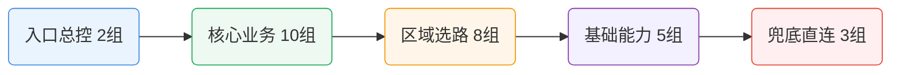

# 🚀 科学上网智能分流配置中心

> 一套以 **Clash Party（Mihomo Smart 内核）JS 覆写脚本** 为基线，同步产出多核心 / 多客户端等价配置的科学上网分流体系。  
> 覆盖核心：**Mihomo (Clash.Meta / Smart)** · **sing-box** · **Xray** · **Shadowrocket / Surge / Loon / Quantumult X 各自私有引擎**  
> 覆盖客户端：**Clash Party / Clash Verge Rev / Mihomo Party / CMFA / FlClash / OpenClash / PassWall2 / Shadowrocket / Surge / Loon / Quantumult X / sing-box / Hiddify / v2rayN**  
> 覆盖设备：**Windows / macOS / Linux / Android / iOS / OpenWrt 软路由**  
> 目标：让同一套分流策略在任何设备、任何代理工具上给出**一致、可解释、可迭代**的结果。

---

## ✨ 项目亮点（先看这个）

- 🧠 **统一架构**：同一套策略模型覆盖多端，降低“设备 A 可用、设备 B 抽风”的割裂感。
- 🧩 **精细分流**：按业务语义拆分策略组，避免“大一统代理”带来的误伤与浪费。
- ⚡ **性能可控**：OpenClash 提供轻量化方案，兼顾命中率与内存占用。
- 🤖 **AI 原生仓库**：**本仓库全部脚本与配置由 AI 编写，并由 AI 持续维护与迭代**。

---

## 🤖 AI 开发与维护声明

### 本仓库的工程原则

1. **全量 AI 编写**：仓库内脚本/配置以 AI 生成与重构为主。
2. **全量 AI 维护**：版本演进、结构整理、说明文档优化由 AI 持续执行。
3. **可读性优先**：配置不只“能跑”，还要“好懂、好改、好排障”。
4. **平台一致性**：尽量让同类业务在不同客户端表现一致。

> ✅ 如果你希望“可追踪”的升级体验，这种 AI 驱动仓库会更适合长期使用。

---

## 🧭 分流策略设计框架（重点）

下面是这套配置的“架构设计图（文字版）”：

```text
订阅节点池
   ↓（节点清洗 + 命名识别 + 低质量过滤）
区域层（Smart Region Layer）
   ↓
业务层（Service Policy Layer）
   ↓
规则层（Rule Provider Layer）
   ↓
DNS/嗅探层（Resolver + Sniffer Layer）
   ↓
兜底层（Fallback Layer）
```

### 1) 区域层：Smart Region Layer 🌍

通过关键字 + 国家/地区语义识别，把节点聚合到区域组（如 HK / TW / JP / SG / US / EU 等），每组使用智能选优策略（如 `url-test` + Smart 能力）完成自动择路。

**设计意义：**
- 降低手工选节点成本；
- 把“连通性问题”隔离在区域层，业务层不用频繁改。

### 2) 业务层：Service Policy Layer 🧱

以业务语义分组（AI 服务、流媒体、社交、开发、云/CDN、广告拦截等），每个业务组只关心“该走哪类路径”，而不是具体节点名。

**设计意义：**
- 业务行为与物理节点解耦；
- 当订阅供应商变化时，业务组可基本无感迁移。

### 3) 规则层：Rule Provider Layer 📚

依赖社区规则源进行能力拼装，不做无谓重复造轮子；在不同平台按资源约束做裁剪组合。

**设计意义：**
- 命中逻辑可解释；
- 便于跟随上游规则修订。

### 4) DNS/嗅探层：Resolver + Sniffer 🔍

采用分层 DNS（国内/国外/回退）+ 嗅探协同，确保 fake-ip 场景下依然能尽量正确识别目标业务。

**设计意义：**
- 降低 DNS 泄漏风险；
- 提高复杂站点与多域业务命中准确率。

### 5) 兜底层：Fallback Layer 🛟

使用 GEOIP / GEOSITE / Private 等规则做最后防线，保证“未知流量不裸奔、已知流量有归属”。

---
## 🧩 Smart 分流规则：28 代理组速览

为了让结构更清晰，下面用“**分层卡片 + 关系图**”展示 28 个代理组，而不是单一大表。



### 🗂️ 代理组与主要 Rule-Providers 对照（Clash Party 实际 28 业务组）

> 只列“主要/高频命中”项，并标明规则来源仓库；不再混入节点组（HK/US/全球节点等）。

| 代理组（与脚本一致） | 主要 rule-providers（示例） | 主要来源仓库 |
|---|---|---|
| 🤖 AI 服务 | `openai` `claude` `gemini` `copilot` `szkane-ai` `acc-copilot` | MetaCubeX / blackmatrix7 / szkane / Accademia |
| 💰 加密货币 | `cryptocurrency` `binance` `szkane-web3` | blackmatrix7 / szkane |
| 🏦 金融支付 | `paypal` `stripe` `visa` `tigerfintech` `acc-bank-*` `acc-vf-*` | blackmatrix7 / Accademia |
| 📧 邮件服务 | `mail` `mailru` `protonmail` `spark` | blackmatrix7 |
| 💬 即时通讯 | `telegram` `telegram-ip` `discord` `whatsapp` `line` `kakaotalk` `acc-signal` | MetaCubeX / blackmatrix7 / Accademia |
| 📱 社交媒体 | `twitter` `twitter-ip` `tiktok` `facebook` `instagram` `snapchat` `reddit` | MetaCubeX / blackmatrix7 |
| 🧑‍💼 会议协作 | `zoom` `slack` `teams` `atlassian` `notion` `remotedesktop` `acc-rustdesk` | ACL4SSR / blackmatrix7 / Accademia |
| 📺 国内流媒体 | `bilibili` `iqiyi` `youku` `tencentvideo` `douyin` `neteasemusic` | blackmatrix7 |
| 📺 东南亚流媒体 | `viu` `biliintl` `iqiyiintl` `wetv` `viki` `acc-kwai` | blackmatrix7 / Accademia |
| 🇺🇸 美国流媒体 | `youtube` `netflix` `netflix-ip` `spotify` `disney` `hulu` `primevideo` | MetaCubeX / blackmatrix7 / szkane |
| 🇭🇰 香港流媒体 | `mytvsuper` `tvb` `encoretvb` `nowe` `rthk` `szkane-bilihmt` | blackmatrix7 / szkane |
| 🇹🇼 台湾流媒体 | `bahamut` `kktv` `litv` `hamivideo` `linetv` `friday` | blackmatrix7 |
| 🇯🇵 日韩流媒体 | `abema` `dazn` `dmm` `tver` `niconico` `rakuten` | blackmatrix7 |
| 🇪🇺 欧洲流媒体 | `bbc` `itv` `all4` `my5` `skygo` `britboxuk` `szkane-uk` | MetaCubeX / blackmatrix7 / szkane |
| 🕹️ 国内游戏 | `steamcn` `wanmeishijie` `wankahuanju` `majsoul` | blackmatrix7 |
| 🎮 国外游戏 | `steam` `epic` `playstation` `xbox` `riot` `ea` `hoyoverse` | blackmatrix7 |
| 🔍 搜索引擎 | `google` `google-ip` `googlesearch` `bing` `scholar` `yandex` | MetaCubeX / blackmatrix7 |
| 📟 开发者服务 | `github` `docker` `gitlab` `python` `developer` `szkane-developer` | blackmatrix7 / szkane |
| Ⓜ️ 微软服务 | `onedrive` `microsoft` `microsoftedge` `acc-microsoftapps` | blackmatrix7 / Accademia |
| 🍎 苹果服务 | `apple` `icloud` `appstore` `appletv` `applemusic` `acc-apple` `acc-applenews` | blackmatrix7 / Accademia |
| 📥 下载更新 | `googlefcm` `systemota` `download` `ubuntu` `mozilla` `android` `acc-macappupgrade` | blackmatrix7 / Accademia |
| ☁️ 云与CDN | `cloudflare` `cloudflare-ip` `cloudfront-ip` `fastly-ip` `akamai` `acc-fastly` | MetaCubeX / blackmatrix7 / Accademia |
| 🛰️ BT/PT Tracker | `privatetracker` `acc-emuleserver` | blackmatrix7 / Accademia |
| 🏠 国内网站 | `cn` `cn-ip` `acc-geositecn` `acc-chinamax` `acc-china` `acc-geo-d-asia-china` | MetaCubeX / blackmatrix7 / Accademia |
| 🚫 受限网站 | `loyalsoldier-gfw` `loyalsoldier-greatfire` `szkane-proxygfw` | Loyalsoldier / szkane |
| 🌐 国外网站 | `proxy` `cnn` `nytimes` `bloomberg` `ebay` `wikipedia` `acc-waybackmachine` | blackmatrix7 / Accademia / szkane |
| 🐟 漏网之鱼 | 以 GEOSITE/GEOIP/FINAL 兜底为主（非单一固定 provider） | MetaCubeX（geo 规则） |
| 🛑 广告拦截 | `anti-ad` `sukka-phishing` `hagezi-tif` `advertising` `privacy` `acc-unsupportvpn` | DustinWin / SukkaW / Hagezi / blackmatrix7 / Accademia |

---

## 🎯 差异化价值：补充 rule-provider 相对原生 `geosite.dat` + `geoip.dat` 的差异

> **本节只谈一件事：匹配层（Axis 1）**——本仓库 ~300 个补充 rule-provider 相对裸用 MetaCubeX / Loyalsoldier 原生数据库，**多覆盖了什么**。
>
> ⚠️ 代理组嵌套 / url-test / Smart / LightGBM / JS 自动归类 / 换机场无感 这些是**策略层（Axis 2）**的能力，**和 geosite/geoip 无关**——无论你匹配源用的是 geosite 还是自定义 rule-provider，策略层都照常工作。本节不混进来谈。

### 两个真正在匹配层的对比维度

| 维度 | 裸用 `geosite.dat` + `geoip.dat` | 本仓库（补充后）|
|---|---|---|
| **域名分类** | ~500 个扁平分类（`openai` / `netflix` / `apple` / `cn` / `gfw`…）| 继承全部原生分类 + **~300 个补充 rule-provider**（目的：填 geosite 的 4 类空白，见下方 4 类）|
| **IP 分类** | 50+ 国家码 + 15 服务 IP 标签（`cloudflare` / `telegram` / `netflix` / `google` / `facebook` / `twitter` / `fastly`…）| **直接使用原生 Loyalsoldier geoip.dat + mmdb，本仓库 0 增量** —— 这个维度没必要再造轮子 |

### 300 个补充 rule-provider 各自填了什么空白（4 类）

**① geosite 暂未收录的新兴服务**

AI / Web3 / 冷门工具 这些领域的域名，geosite.dat 往往滞后 2–4 周才收录。本仓库通过 szkane / Accademia / 自定义 domain-suffix 即时补上：

- `cursor.com` / `v0.dev` / `character.ai` / `mistral.ai` / `perplexity.ai` / `pi.ai` / `midjourney.com` / `runpod.io` / `openrouter.ai` …
- `szkane-ai`（含 CiciAI 等 geosite 未录的 AI 平台）
- `szkane-web3`（新 DeFi / DEX 域名）

**② 把 geosite "总类" 拆成可独立决策的子类**

`geosite:apple` 是一个**总类**，所有 Apple 子服务共享同一策略；裸用 geosite 只能做"Apple 全代理 or 全直连"。本仓库拆成 12 个独立 rule-provider：

```yaml
apple / icloud       # → direct（境内访问快）
applemusic           # → proxy（国区订阅看境外歌单需代理）
appstore             # → direct（境内下载省带宽）
appletv              # → proxy（解锁境外节目库）
testflight           # → proxy（有些 beta 需要境外）
siri                 # → proxy（国区 Siri 被阉割）
appledev / findmy    # → proxy
applefirmware        # → direct（固件几 GB 不走代理）
```

这种精细度，`geosite:apple` 一个总类做不到。Google 家族、Microsoft 家族同理。

**③ 广告拦截的"多源纵深"，覆盖 geosite 单源不覆盖的威胁类型**

`geosite:category-ads-all` 是一个分类兜底。本仓库在同一个 🛑 广告拦截组下接入**多个来源**，**每源覆盖不同威胁**（不是同一类型重复加码）：

```yaml
anti-ad                    # 广告联盟域名（DustinWin，5万+）
sukka-phishing             # 钓鱼网站（SukkaW，13万条）         ← geosite 没有
hagezi-tif                 # 威胁情报 TIF（恶意软件/C2/scam）    ← geosite 没有
acc-hijackingplus          # 运营商 DNS 劫持                      ← geosite 没有
acc-blockhttpdnsplus       # HTTP DNS 绕 SDK                      ← geosite 没有
acc-prerepaireasyprivacy   # 隐私追踪（FB Pixel / GA / Mixpanel）  ← geosite 没有
miuiprivacy                # 小米隐私上报                          ← geosite 没有
jiguangtuisong             # 极光推送 SDK                          ← geosite 没有
category-ads-all           # 兜底（原生 geosite）
```

广告 / 钓鱼 / 恶意软件 / DNS 劫持 / 隐私追踪 / SDK 埋点——这些是**不同类型的威胁**，geosite 只管广告一类。

**④ 地区长尾 + 特殊场景**

geosite 主流分类之外的小众需求：

- `szkane-uk`（英国流媒体细分，geosite 的 `bbc` / `itv` 覆盖不全）
- `szkane-bilihmt`（B 站港澳台地区，geosite 只有 bilibili + biliintl 两个总类）
- `acc-aqara-cn`（绿米 IoT 国内端点，普通 `geosite:cn` 不带 IoT 专用 ASN）
- `acc-homeip-us` / `acc-homeip-jp`（美日住宅 IP 段识别，geoip.dat 只到国家级）

### 典型场景对比（让差异具体到肉眼可见）

> 下面 4 个场景**两边都假设用本仓库的 28+9 代理组架构**（Axis 2 相同），唯一变量是**匹配源**：一边只用原生 `geosite.dat` + `geoip.dat`，另一边叠加 ~300 补充 rule-provider。专心看匹配层造成的实际差异。

#### 🎬 场景 1：Apple 家族子服务按需独立分流

**需求**：AppStore 走直连（境内下载省带宽）、TestFlight 走美国（境外 beta 访问）、AppleMusic 走代理（解锁国区没有的境外歌单）、iCloud/固件走直连。

```yaml
# ─── 只用原生 geosite ───
rules:
  - GEOSITE,apple,??     # 问题：apple 是个总类，上面所有子服务混在一起
                         # 只能选一个策略：全直连（AppleMusic 解锁失败）
                         # 或全代理（AppStore 下载几 GB 浪费流量 + 延迟）
```

```yaml
# ─── 本仓库（geosite + bm7 Apple 子类 补充）───
rules:
  - RULE-SET,applemusic,🍎 苹果服务      # bm7 独立子列表 → 组指向美国节点 → 解锁
  - RULE-SET,appstore,📥 下载更新         # bm7 独立 → 组指向 DIRECT → 省带宽
  - RULE-SET,appletv,🇺🇸 美国流媒体       # bm7 独立 → 美国节点
  - RULE-SET,testflight,🍎 苹果服务       # bm7 独立 → 用户改指向美国节点
  - RULE-SET,siri,🍎 苹果服务             # bm7 独立 → 代理（国区被阉割）
  - RULE-SET,applefirmware,📥 下载更新    # bm7 独立 → DIRECT（固件几 GB）
  - RULE-SET,apple,🍎 苹果服务            # metaDomain 总类兜底
  - RULE-SET,icloud,🍎 苹果服务           # metaDomain 独立 → DIRECT
```

**肉眼可见的差异**：用户点一个按钮更新 iOS beta，流量走美国节点（TestFlight 规则精确命中）；切到 AppStore 下载 Xcode，流量直连（走 appstore 规则）；两种情境自动区分——**只用 geosite:apple 做不到**。

---

#### 🤖 场景 2：新 AI 服务（cursor / v0 / pi.ai）geosite 滞后覆盖

**背景**：Claude Sonnet 4 / Cursor / V0 / Perplexity / Mistral 这类新 AI 服务上线后，v2fly/MetaCubeX 的 geosite.dat 通常要 **2–4 周**才把域名收录到正式分类里。在这期间：

```yaml
# ─── 只用原生 geosite ───
rules:
  - GEOSITE,openai,🤖 AI 服务    # 命中 openai.com / chatgpt.com ✓
  - GEOSITE,anthropic,🤖 AI 服务  # 命中 claude.ai ✓（老版可能 geosite 没有）
  # 问题：cursor.com / v0.dev / perplexity.ai / mistral.ai / pi.ai 不在
  # 当前 geosite:openai 或 geosite:anthropic 里 → 全部 fall through
  - GEOIP,CN,DIRECT               # ...fall through 到这里
  - MATCH,🐟 漏网之鱼              # ...或掉到 FINAL
  # → cursor / v0 走的是 FINAL 组的默认节点（可能不是 US 节点）→ 403 或慢
```

```yaml
# ─── 本仓库（geosite + szkane/domain-suffix 补充）───
rule-providers:
  szkane-ai:      # → 覆盖 CiciAI / 新兴 AI 平台（szkane 维护者紧跟新服务）
  acc-copilot:    # → GitHub Copilot / Accademia 版本
  acc-grok:       # → Grok / xAI
  acc-gemini:     # → Gemini 增强

rules:
  - RULE-SET,szkane-ai,🤖 AI 服务
  - DOMAIN-SUFFIX,cursor.com,🤖 AI 服务      # 手工补充新域名
  - DOMAIN-SUFFIX,v0.dev,🤖 AI 服务
  - DOMAIN-SUFFIX,perplexity.ai,🤖 AI 服务
  - DOMAIN-SUFFIX,mistral.ai,🤖 AI 服务
  - DOMAIN-SUFFIX,pi.ai,🚫 受限网站            # PI.ai 在国内特殊（FIX#20-P2）
  - ... # 其他 20+ 新 AI 域名
  - GEOSITE,openai,🤖 AI 服务                 # 原生 geosite 兜底主流 AI
```

**肉眼可见的差异**：新服务上线当天就能正确路由到 🤖 AI 组 → 美国节点；**不用等 geosite 收录**。等 geosite.dat 更新了，这里的 domain-suffix 仍然冗余但无害（规则前匹配先停）。

---

#### 🛑 场景 3：广告拦截纵深 vs 单源兜底

**背景**：访问一个被挂马的钓鱼网站 `fake-binance-login.xyz`（假冒币安登录页，想骗你钱包密钥）。

```yaml
# ─── 只用原生 geosite ───
rules:
  - GEOSITE,category-ads-all,🛑 广告拦截    # ← 只收广告域名，不收钓鱼
  # 问题：钓鱼域名不在 category-ads-all 里，fall through → 用户访问到钓鱼页
```

```yaml
# ─── 本仓库（多源纵深）───
rules:
  - RULE-SET,anti-ad,🛑 广告拦截              # 广告联盟域名（DustinWin 5万+）
  - RULE-SET,sukka-phishing,🛑 广告拦截       # ✓ 13 万钓鱼域名（SukkaW 独家）← 这里拦住
  - RULE-SET,hagezi-tif,🛑 广告拦截           # 威胁情报（恶意软件/C2）← 即使 sukka 没收也能拦
  - RULE-SET,acc-hijackingplus,🛑 广告拦截    # 运营商 DNS 劫持
  - RULE-SET,acc-prerepaireasyprivacy,🛑 广告拦截  # 隐私追踪（FB Pixel / GA）
  - RULE-SET,miuiprivacy,🛑 广告拦截          # 小米隐私上报
  - RULE-SET,jiguangtuisong,🛑 广告拦截       # 极光推送 SDK
  - GEOSITE,category-ads-all,🛑 广告拦截      # 兜底
```

**肉眼可见的差异**：**钓鱼域名被 sukka-phishing 拦截**，浏览器显示连接被 REJECT；**只用 geosite 放行**，用户真的访问到钓鱼页，可能损失加密货币 / 银行密码。这不是"命中率高低"的事，是"**威胁类型覆盖全不全**"的事——geosite 只管一个维度（广告），其他威胁类型（钓鱼/恶意软件/隐私追踪/SDK 埋点）geosite 没有对应分类。

---

#### 📱 场景 4：小米手机 / 国内 App SDK 埋点上报拦截

**背景**：你用小米手机 + 装了一堆国产 App（淘宝、拼多多、美团、京东）。这些 App 每分钟都在向以下端点上传你的**位置、通讯录、行为日志、设备指纹**：

- `data.mistat.xiaomi.com`、`tracking.miui.com`（小米系统自带）
- `sdk.jiguang.cn`、`api.jpush.cn`（极光推送 SDK）
- `umengadmin.mobileapptracking.com`、`um.cnzz.com`（友盟 / 创兴）
- `pbl.mobileapptracking.com`（多盟移动广告追踪）

```yaml
# ─── 只用原生 geosite ───
# 问题：geosite.dat 里 没有 `miuiprivacy` / `jiguangtuisong` / `youmengchuangxiang` / `domob` 
# 这种专门针对"国内 SDK 埋点上报"的分类
# → 所有这些上报流量 fall through，正常发出 → 你的隐私照常被上报
```

```yaml
# ─── 本仓库（bm7 国内 SDK 拦截集补充）───
rules:
  - RULE-SET,miuiprivacy,🛑 广告拦截          # ← 拦截 mistat.xiaomi / tracking.miui
  - RULE-SET,jiguangtuisong,🛑 广告拦截       # ← 拦截极光 SDK
  - RULE-SET,youmengchuangxiang,🛑 广告拦截   # ← 拦截友盟 + 创兴
  - RULE-SET,domob,🛑 广告拦截                # ← 拦截多盟
```

**肉眼可见的差异**：在 Clash Party 的"连接"面板上，每天会看到 **几千条**针对这些域名的 REJECT 记录（命中数 > 0，不是 0%）。没有这些补充 rule-provider，这些上报流量**全部**正常发出到国内 SDK 服务器。geosite 上游**不维护**这些"国内隐私上报"类的分类——因为它是面向国际社区的，不管中国特有 SDK。

---

### 加法原则：每加 1 条 rule-provider 必须答"我比 geosite 多覆盖了什么"

这是本仓库和"无脑狂加规则集"的根本区别（CLAUDE.md / AGENTS.md 强制）：

| 加法场景 | 判定 | 理由 |
|---|:-:|---|
| 和 `geosite.dat` 某分类 **> 95% 重叠** | ❌ **拒绝** | 纯冗余，浪费内存 + 冷启动。v5.2.5 FIX#23-P1 据此删 `acc-geositecn` / `acc-china` |
| 和已有 rule-provider **逐条重复**但无新条目 | ❌ **拒绝** | 同上 |
| 填补 **geosite 未收录的新兴服务** | ✅ 通过 | 第 ① 类 |
| 拆 **geosite 总类**为可独立决策的子类 | ✅ 通过 | 第 ② 类 |
| 多源**互补**覆盖同一业务的不同威胁类型 | ✅ 通过 | 第 ③ 类 |
| **地区长尾 / 特殊 ASN** | ✅ 通过 | 第 ④ 类 |
| geosite 里叫法不同的同一服务（`snap` vs `snapchat`） | ⚠️ 条件通过 | 别名映射，不加新条目只修 bug |

**反例**（已在 v5.2.5 删除）：
- ~~`acc-geositecn`~~ → 100% 和 `geosite:cn` 重复 → 删
- ~~`acc-china`~~ → 95% 和 `acc-chinamax` + `geosite:cn` 重叠 → 删

### 一句话收尾

> 本仓库在匹配层的增量 = **geosite 未收录的新兴服务** + **geosite 总类的子类拆分** + **多源纵深广告拦截** + **地区长尾 ASN**。**原生 geosite / geoip 能覆盖的部分一律不重复造轮子**。300 个补充 rule-provider 的每一条，都对应上述 4 类空白之一。
>
> 代理组嵌套 / Smart / LightGBM / JS 自动归类这些架构能力是另一维度（Axis 2），和匹配源用什么数据库**无关**，本节不涉及。

---

## 🛡️ DNS 净化：科学上网的第一道防线

> 分流规则配得再好，**DNS 漏了照样白搭**。这一节解释为什么 DNS 在科学上网里是"基石"，并给出本仓库的推荐配置（完整 YAML 见 `Clash Party/README.md` 第四章 DNS 段）。

### 为什么 DNS 比节点协议更重要？

科学上网的三个主要敌人——**GFW / ISP / 机场节点封控**——**全都从 DNS 层下手**，早于节点握手：

| 威胁 | 常见手法 | 没做 DNS 净化的后果 |
|---|---|---|
| **GFW DNS 污染** | 对敏感域名（google/youtube/telegram/github…）的明文 DNS 查询返回假 IP | 浏览器拿到假 IP → 走代理组里的节点也打不通（因为 IP 是假的）|
| **ISP DNS 劫持** | 你的 53 端口 UDP 包被运营商拦截 → 返回广告页或空白 | 机场节点域名解析失败；`jsdelivr.net` 冷启动下载规则失败 |
| **运营商流量审计** | 通过明文 DNS 记录你访问了哪些域名（即便流量本身加密）| 上网日志被运营商完整记录；风控系统据此限速或约谈 |
| **机场节点 IP 暴露** | 解析 `node.xxx-airport.com` 的 DNS 查询走 ISP → ISP 知道你"经常解析一个特定 VPS 域名" | 机场节点 IP 被针对性封禁；切换新节点没用（运营商封域名不封 IP）|
| **DNS 缓存污染** | 本地或上游 DNS 缓存了错的结果 | 机场节点切 IP 后你还在走旧 IP；解锁流媒体时 CDN 选错 |

**结论**：DNS 是整个代理链路里**最容易被在不加密的情况下植入侧信道**的一环。加密 DNS（DoH / DoT）不是可选项，是**必选项**。

### 本仓库的 DNS 四层分工

Clash Party / CMFA / OpenClash 都采用同一套分层方案（详见 `Clash Party/README.md` 第四章的完整 YAML）：

```
┌─────────────────────────────────────────────────────────────────┐
│  ① default-nameserver（明文 UDP，仅用于 bootstrap）             │
│     223.5.5.5 / 119.29.29.29 / 1.1.1.1 / 8.8.8.8                │
│     作用：启动时解析下面那些 DoH URL 的域名（dns.alidns.com 等） │
│     只查 4 个 IP，不参与任何业务查询 → 零暴露面                  │
└──────────────┬──────────────────────────────────────────────────┘
               │ bootstrap 成功后，所有业务查询全走加密 DoH：
               ▼
┌─────────────────────────────────────────────────────────────────┐
│  ② nameserver（国内域名主通道，DoH）                              │
│     https://223.5.5.5/dns-query     (AliDNS)                    │
│     https://doh.pub/dns-query        (DNSPod / Tencent)         │
│     作用：大陆站点 / 国内 CDN 用国内权威 DoH → 不被 ISP 记录     │
├─────────────────────────────────────────────────────────────────┤
│  ③ proxy-server-nameserver（机场节点域名解析，DoH）               │
│     https://1.1.1.1/dns-query       (Cloudflare)                │
│     https://8.8.8.8/dns-query       (Google)                    │
│     https://223.5.5.5/dns-query     (AliDNS)                    │
│     https://doh.pub/dns-query       (DNSPod)                    │
│     作用：解析 node.xxx-airport.com 时走海外 DoH → 机场节点      │
│           域名和 IP 都不暴露给 ISP，也不被 DNS 污染              │
├─────────────────────────────────────────────────────────────────┤
│  ④ fallback（海外域名回退通道，DoH + GeoIP 解毒）                 │
│     https://1.1.1.1/dns-query + https://8.8.8.8/dns-query       │
│     fallback-filter.geoip-code: CN                              │
│     作用：国外域名若查出 CN 段 IP（说明被污染），自动用 fallback │
│           重查 → 避开 GFW 注入的假 IP                            │
└─────────────────────────────────────────────────────────────────┘
```

### 为什么这套分工能同时解决 5 个威胁

| 威胁 | 本方案如何化解 |
|---|---|
| GFW DNS 污染 | ① ~ ④ 全部走 DoH（TLS 加密），GFW 看不到 DNS 内容更注入不了；④ 的 `fallback-filter.geoip-code: CN` 再做一次"看到 CN IP 就切换上游"的解毒逻辑 |
| ISP DNS 劫持 | 53 端口只用于 bootstrap 那 4 个 IP，业务查询 **100% 走 443 DoH**；ISP 连 SNI 都看不到（Cloudflare / 阿里 DNS 的 ECH/CECPQ 进一步加密） |
| 运营商流量审计 | DoH 走 HTTPS 443，和正常网页流量外观一致；运营商**不能区分**你在查 DNS 还是刷网页 |
| 机场节点 IP 暴露 | ③ `proxy-server-nameserver` 让节点域名解析走海外 DoH，ISP 完全不知道你连过这个机场 |
| DNS 缓存污染 | fake-ip 模式下本地不缓存真实 IP（每次查询返回 198.18.x.x 假 IP，由 mihomo 实时映射真实出站）；节点切 IP 后**立刻生效**，无缓存延迟 |

### 推荐做法

1. **首选加密 DoH**。不要用明文 UDP DNS（`114.114.114.114` / `8.8.8.8` 直连 53）——`114.114.114.114` 在大陆运营商会做劫持，`8.8.8.8` 会被 GFW 污染 + ISP 看到你在用海外 DNS。
2. **国内 DoH 建议用 AliDNS + DNSPod 组合**（`https://223.5.5.5/dns-query` + `https://doh.pub/dns-query`）。两家都是中国合规 DoH，在 443 端口的 TLS 流量里 ISP 无法区分。
3. **海外 DoH 建议用 Cloudflare + Google**（`https://1.1.1.1/dns-query` + `https://8.8.8.8/dns-query`）。Cloudflare 额外支持 ODoH / ECH，隐私更好。
4. **`proxy-server-nameserver` 必须单独配置**（容易忽略）。这是解决"机场节点 IP 被针对性封"的关键——让机场节点域名的解析也走海外 DoH 而不是默认通道。
5. **fake-ip 模式强烈推荐**（`enhanced-mode: fake-ip`）。比 redir-host 快 + 无本地缓存污染 + 规则命中更精准。
6. **别在 `hosts:` 里写业务域名**。`hosts:` 只适合给 bootstrap DoH（例如 `one.one.one.one → 1.1.1.1`）写兜底 IP，用来规避 DNS 冷启动死锁；写业务域名会让本配置的规则命中失效。

### 怎么验证 DNS 真的净化了

```bash
# 1) 检查是否泄漏 DNS（浏览器里访问）
https://dnsleaktest.com          # 应只显示你配置的 DoH 上游，不应看到 ISP DNS
https://whoami.cloudflare.com    # 应显示 Cloudflare DoH

# 2) 命令行直接测 DoH 可达
curl -H 'accept: application/dns-json' \
  'https://doh.pub/dns-query?name=google.com&type=A'
# 成功 = 返回 JSON（含 Answer 字段）

# 3) 抓包确认查询走 443（不是 53）
tcpdump -n -i any port 53        # 应只看到 bootstrap 的 4 个 IP 被查一次
tcpdump -n -i any port 443       # 应看到持续流量 → DoH 正常
```

### 各端配置要点（跳过手动配的对照）

| 端 | DNS 段已内置 | 用户要做的 |
|---|:-:|---|
| Clash Party / Verge / Mihomo Party | ❌（脚本不注入 DNS，需粘到 UI Mixin） | 把 `Clash Party/README.md` 第四章的 DNS YAML 粘到客户端 Mixin / 合并字段 |
| CMFA / FlClash | ✅（已写在 YAML 里） | 无 |
| OpenClash slim / full | ✅（脚本已注入） | 无 |
| Shadowrocket | ✅（`.conf` 已含 DoH 字段） | iOS 15+ 即可，不需额外操作 |
| Surge / Loon / QX | ✅（`.conf` 已含 DoH） | 无 |
| SingBox / Hiddify / HomeProxy | ✅（JSON 已含 DoH server） | 无 |
| v2rayN（mihomo 核）| ✅（吃 CMFA YAML） | 在 v2rayN 设置里勾选"使用配置文件里的 DNS 设置" |
| v2rayN（sing-box / Xray 核）| ⚠️ | 参见 `v2rayN/README.md` |

---

## 🔌 各端协议支持 + 快速导入速查

一张表搞定："**机场给什么协议 → 选哪个端 → 去哪看教程**"。列名缩写 + 具体配置文件 → 见表下方。

| 协议 | Clash<br>Party | CMFA | Open<br>Clash | Shadow<br>rocket | Surge | Loon | QX | sing-<br>box | v2rayN<br>Xray | v2rayN<br>mihomo |
|---|:-:|:-:|:-:|:-:|:-:|:-:|:-:|:-:|:-:|:-:|
| **SS (+ 2022)** | ✅ | ✅ | ✅ | ✅ | ✅ | ✅ | ✅ | ✅ | ✅ | ✅ |
| **SSR** | ✅ | ✅ | ✅ | ✅ | ❌ | ✅ | ✅ | ❌ | ❌ | ✅¹ |
| **VMess** | ✅ | ✅ | ✅ | ✅ | ✅ | ✅ | ✅ | ✅ | ✅ | ✅ |
| **VLESS** | ✅ | ✅ | ✅ | ✅ | ❌ | ✅ | ⚠️ | ✅ | ✅ | ✅ |
| **REALITY + Vision** | ✅ | ✅ | ✅ | ✅ | ❌ | ✅ | ⚠️ | ✅ | ✅ | ✅ |
| **Trojan** | ✅ | ✅ | ✅ | ✅ | ✅ | ✅ | ✅ | ✅ | ✅ | ✅ |
| **Hysteria 1** | ✅ | ✅ | ✅ | ✅ | ❌ | ✅ | ❌ | ✅ | ❌ | ✅ |
| **Hysteria 2** | ✅ | ✅ | ✅ | ✅ | ⚠️² | ✅ | ❌ | ✅ | ❌ | ✅ |
| **TUIC v5** | ✅ | ✅ | ✅ | ✅ | ❌ | ✅ | ❌ | ✅ | ❌ | ✅ |
| **WireGuard** | ✅ | ✅ | ✅ | ✅ | ✅ | ✅ | ❌ | ✅ | ⚠️ | ✅ |
| **AnyTLS** | ✅ | ✅ | ✅ | ✅ | ❌ | ⚠️ | ❌ | ✅ | ❌ | ✅ |
| **ShadowTLS** | ✅ | ✅ | ✅ | ✅ | ❌ | ⚠️ | ❌ | ✅ | ❌ | ✅ |
| **Snell v4** | ✅ | ✅ | ✅ | ✅ | ✅ | ✅ | ❌ | ❌ | ❌ | ✅¹ |
| **Mieru** | ✅ | ✅ | ✅ | ⚠️ | ❌ | ❌ | ❌ | ❌ | ❌ | ✅¹ |
| **SSH 出站** | ✅ | ✅ | ✅ | ❌ | ❌ | ❌ | ❌ | ✅ | ❌ | ✅ |
| **HTTP / SOCKS5** | ✅ | ✅ | ✅ | ✅ | ✅ | ✅ | ✅ | ✅ | ✅ | ✅ |
| **LightGBM 自动择优** | ✅³ | ❌ | ✅ | ❌ | ❌ | ❌ | ❌ | ❌ | ❌ | ❌ |
| **📖 子目录** | [Clash Party](./Clash%20Party/) | [CMFA](./Clash%20Meta%20For%20Android/) | [OpenClash](./OpenClash/) | [Shadow<br>rocket](./Shadowrocket/) | [Surge](./Surge/) | [Loon](./Loon/) | [QX](./Quantumult%20X/) | [SingBox](./SingBox/) | [v2rayN](./v2rayN/) | [v2rayN](./v2rayN/) |

> ✅ 原生支持 · ⚠️ 部分 / 新版本才有 · ❌ 不支持
> ¹ 需 v2rayN 切到 mihomo 核心 · ² Surge 5.9+ 才有 · ³ 需 mihomo Smart Alpha + JS 覆写

**🏷️ 客户端列名缩写对照**：
- **Clash Party** = Clash Party / Clash Verge Rev / Mihomo Party
- **CMFA** = Clash Meta For Android / FlClash / mihomo-party-android
- **QX** = Quantumult X
- **sing-box** = sing-box 通用客户端（SFA / SFM / SFI / Hiddify / NekoBox / Karing / HomeProxy）
- **v2rayN Xray** = v2rayN 默认 Xray 核模式
- **v2rayN mihomo** = v2rayN 切到 mihomo 或 sing-box 核

**📁 具体配置文件**（点击上方 📖 列进对应子目录查看）：
- Clash Party → `Clash Smart内核覆写脚本.js`（JS 覆写脚本）
- CMFA → `clash-smart-cmfa.yaml`
- OpenClash → `openclash_custom_overwrite.sh`（slim） / `openclash_custom_overwrite_full.sh`（full） + `clash-smart-openclash.conf`
- Shadowrocket → `shadowrocket-smart.conf`
- Surge → `surge-smart.conf`
- Loon → `loon-smart.conf`
- Quantumult X → `qx-smart.conf`
- SingBox → `singbox-smart-full.json`（推荐） / `singbox-smart.json`（精简）
- v2rayN Xray → `v2rayn-smart-xray-routing.json`
- v2rayN mihomo/sing-box → 复用 `Clash Meta For Android/clash-smart-cmfa.yaml` 或 `SingBox/singbox-smart-full.json`

### 一句话决策树
- 机场只给 **SS / VMess / Trojan**：任何客户端都行，**按设备+预算挑**
- 机场主推 **VLESS + REALITY**：Mihomo / sing-box / Shadowrocket / Loon / v2rayN 任选
- 机场主推 **Hysteria 2 / TUIC**：避开 **Surge (旧版) / QX / Xray**；其它都行
- 机场是 **Snell 专用**（Surge 机场）：Shadowrocket / Surge / Loon / Mihomo 系
- 想要 **WireGuard**：除 QX 都行
- 想要 **LightGBM 自动择优**：**只能走 Clash Party / OpenClash** + Mihomo Smart Alpha 内核 + JS 覆写
- 协议 + 价格性价比：**iOS 上 Shadowrocket (¥20)** / **Android 上 CMFA (免费)** / **桌面上 Mihomo Party (免费)** / **软路由上 OpenClash (免费)**
### 软路由用户：已装其它代理插件的对号入座

**对照上面矩阵的列**，按你插件底层内核选：

- **ShellClash**（`juewuy/ShellCrash`，mihomo 核）→ 用 **CMFA 列** 的 `clash-smart-cmfa.yaml`
- **HomeProxy**（sing-box 官方 LuCI 插件，sing-box 核）→ 用 **sing-box 列** 的 `singbox-smart-full.json`
- **Passwall / Passwall2**（xray / sing-box 核，**没有 proxy-groups 嵌套**）→ 首选**迁移到 OpenClash** 拿完整能力；或保留插件用本仓库 `Passwall2/` 目录的 **shunt rule 降级版**（28 条手工展平，功能约 OpenClash slim 的 70%）
- **SSR Plus+**（已停更 + 无 geosite / rule_set 层）→ 直接换 **OpenClash**

> 💡 Passwall 系**能**做 `geosite` / `geoip` / `rule_set` 的规则匹配，**不能**做 mihomo 的「业务组 → 区域组 → 节点」两级 `select` + `url-test` 嵌套。想要完整的 28+9 架构 + LightGBM + 机场换节点自动归位，只有 mihomo 系（OpenClash / CMFA / ShellClash）能原生给。详细差异见 `Passwall2/README.md`。

---

## 📌 适用人群

- 想“一套配置跑多端”的用户；
- 不想手工维护大量策略组但又追求精细分流的用户；
- 希望借助 AI 持续优化配置工程质量的用户。

---

## 🙏 致谢（上游依赖）

本仓库主要做**编排、覆写、适配与维护**——**真正的重活都是下面这些项目做的**，按类别一行列出：

**🧠 核心代理内核**：[MetaCubeX/mihomo](https://github.com/MetaCubeX/mihomo) / [mihomo Smart Alpha](https://github.com/MetaCubeX/mihomo/tree/Alpha) / [vernesong/LightGBM Model](https://github.com/vernesong/mihomo/releases/download/LightGBM-Model/Model.bin) / [SagerNet/sing-box](https://github.com/SagerNet/sing-box) / [XTLS/Xray-core](https://github.com/XTLS/Xray-core) / [hiddify/hiddify-sing-box](https://github.com/hiddify/hiddify-sing-box)

**📱 客户端**：[mihomo-party](https://github.com/mihomo-party-org/mihomo-party) / [clash-verge-rev](https://github.com/clash-verge-rev/clash-verge-rev) / [ClashMetaForAndroid](https://github.com/MetaCubeX/ClashMetaForAndroid) / [FlClash](https://github.com/chen08209/FlClash) / [OpenClash](https://github.com/vernesong/OpenClash) / [HomeProxy](https://github.com/immortalwrt/homeproxy) / [ShellCrash](https://github.com/juewuy/ShellCrash) / [openwrt-passwall2](https://github.com/xiaorouji/openwrt-passwall2) / [v2rayN](https://github.com/2dust/v2rayN) / [hiddify-app](https://github.com/hiddify/hiddify-app)

**📚 规则数据库**：[MetaCubeX/meta-rules-dat](https://github.com/MetaCubeX/meta-rules-dat)（geosite） / [Loyalsoldier/geoip](https://github.com/Loyalsoldier/geoip)（geoip + mmdb + asn） / [Loyalsoldier/clash-rules](https://github.com/Loyalsoldier/clash-rules) / [Loyalsoldier/v2ray-rules-dat](https://github.com/Loyalsoldier/v2ray-rules-dat)

**📦 业务规则集**：[blackmatrix7/ios_rule_script](https://github.com/blackmatrix7/ios_rule_script)（主力） / [Accademia/Additional_Rule_For_Clash](https://github.com/Accademia/Additional_Rule_For_Clash) / [DustinWin/ruleset_geodata](https://github.com/DustinWin/ruleset_geodata) / [ACL4SSR](https://github.com/ACL4SSR/ACL4SSR) / [SukkaW/Surge](https://github.com/SukkaW/Surge) / [hagezi/dns-blocklists](https://github.com/hagezi/dns-blocklists) / [MiHomoer/MiHomo-Hagezi](https://github.com/MiHomoer/MiHomo-Hagezi) / [szkane/Rules](https://github.com/szkane/Rules) / [privacy-protection-tools/anti-AD](https://github.com/privacy-protection-tools/anti-AD)

**🛠️ 辅助工具**：[Sub-Store](https://github.com/sub-store-org/Sub-Store) / [KOP-XIAO/QuantumultX](https://github.com/KOP-XIAO/QuantumultX) / [Koolson/Qure](https://github.com/Koolson/Qure) / [v2fly/domain-list-community](https://github.com/v2fly/domain-list-community)

**💳 商业闭源客户端**：[Shadowrocket](https://apps.apple.com/app/shadowrocket/id932747118) / [Surge](https://nssurge.com/) / [Loon](https://apps.apple.com/app/loon/id1373567447) / [Quantumult X](https://apps.apple.com/app/quantumult-x/id1443988620)

**⚠️ 未逐项列出但确实贡献的**：所有向 `v2fly/domain-list-community` + `MaxMind / GeoCN` 提交域名 / IP CIDR 的个人贡献者（数据库真正的脊梁）· Issue / PR 里报告过命中错误 / 节点无法识别 / 规则失效的用户。

> 如果本仓库遗漏了你贡献的上游项目，欢迎开 Issue 指出——**所有真正做事的人都值得被点名**。

## 💖 捐赠 / 给维护者买杯咖啡

本仓库纯个人 + AI 维护，**没广告 / 没商业合作 / 永久免费开源**。如果它帮你省了翻墙调试的时间、让你的 ChatGPT 不再 403、或者拦住过一次钓鱼页，欢迎打赏一杯咖啡 ☕。

<p align="center">
  <!-- TODO: 维护者手动贴入微信收款码图片（建议放到 docs/ 或本仓库任意目录后调整路径）-->
  
  &nbsp;&nbsp;&nbsp;&nbsp;
  <!-- TODO: 维护者手动贴入支付宝收款码图片 -->
  
</p>

<p align="center"><em>左：微信 &nbsp;|&nbsp; 右：支付宝</em></p>

> **打赏完全自愿，不影响任何功能**——本仓库 100% 开源，所有规则 / 配置 / 更新永久免费，不会因是否打赏而有差异。

不方便打赏也能**同等支持**：

- ⭐ **Star 本仓库** 让更多人看见
- 🐛 **开 Issue** 报告命中错误 / 规则失效 / 新机场节点没被识别
- 📝 **PR 贡献** 新兴服务域名补充 / 地区正则修正 / 某个客户端的新字段适配
- 📣 **告诉朋友** "还有一个 AI 全仓维护的科学上网配置"

---

## ⚠️ 免责声明

- 本仓库仅用于网络技术学习与配置研究，不提供任何订阅服务；
- 请遵守你所在地区法律法规；
- 使用本仓库产生的风险需自行评估与承担。

---

## 📄 License

默认采用 **MIT License**。第三方规则与数据资产遵循其各自许可证。
