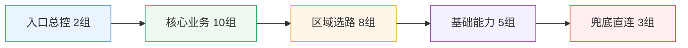

# 🚀 科学上网智能分流配置中心

> 一套围绕 **Mihomo （Smart） 内核** 打造的多平台 Clash 配置体系。  
> 目标：让你在 **Android / iOS / OpenWrt / 桌面端** 获得一致、可解释、可迭代的分流体验。

---

## ✨ 项目亮点（先看这个）

- 🧠 **统一架构**：同一套策略模型覆盖多端，降低“设备 A 可用、设备 B 抽风”的割裂感。
- 🧩 **精细分流**：按业务语义拆分策略组，避免“大一统代理”带来的误伤与浪费。
- ⚡ **性能可控**：OpenClash 提供轻量化方案，兼顾命中率与内存占用。
- 🤖 **AI 原生仓库**：**本仓库全部脚本与配置由 AI 编写，并由 AI 持续维护与迭代**。

---

## 🤖 AI 开发与维护声明

### 本仓库的工程原则

1. **全量 AI 编写**：仓库内脚本/配置以 AI 生成与重构为主。
2. **全量 AI 维护**：版本演进、结构整理、说明文档优化由 AI 持续执行。
3. **可读性优先**：配置不只“能跑”，还要“好懂、好改、好排障”。
4. **平台一致性**：尽量让同类业务在不同客户端表现一致。

> ✅ 如果你希望“可追踪”的升级体验，这种 AI 驱动仓库会更适合长期使用。

---

## 🧭 分流策略设计框架（重点）

下面是这套配置的“架构设计图（文字版）”：

```text
订阅节点池
   ↓（节点清洗 + 命名识别 + 低质量过滤）
区域层（Smart Region Layer）
   ↓
业务层（Service Policy Layer）
   ↓
规则层（Rule Provider Layer）
   ↓
DNS/嗅探层（Resolver + Sniffer Layer）
   ↓
兜底层（Fallback Layer）
```

### 1) 区域层：Smart Region Layer 🌍

通过关键字 + 国家/地区语义识别，把节点聚合到区域组（如 HK / TW / JP / SG / US / EU 等），每组使用智能选优策略（如 `url-test` + Smart 能力）完成自动择路。

**设计意义：**
- 降低手工选节点成本；
- 把“连通性问题”隔离在区域层，业务层不用频繁改。

### 2) 业务层：Service Policy Layer 🧱

以业务语义分组（AI 服务、流媒体、社交、开发、云/CDN、广告拦截等），每个业务组只关心“该走哪类路径”，而不是具体节点名。

**设计意义：**
- 业务行为与物理节点解耦；
- 当订阅供应商变化时，业务组可基本无感迁移。

### 3) 规则层：Rule Provider Layer 📚

依赖社区规则源进行能力拼装，不做无谓重复造轮子；在不同平台按资源约束做裁剪组合。

**设计意义：**
- 命中逻辑可解释；
- 便于跟随上游规则修订。

### 4) DNS/嗅探层：Resolver + Sniffer 🔍

采用分层 DNS（国内/国外/回退）+ 嗅探协同，确保 fake-ip 场景下依然能尽量正确识别目标业务。

**设计意义：**
- 降低 DNS 泄漏风险；
- 提高复杂站点与多域业务命中准确率。

### 5) 兜底层：Fallback Layer 🛟

使用 GEOIP / GEOSITE / Private 等规则做最后防线，保证“未知流量不裸奔、已知流量有归属”。

---

## 🧩 Clash Party（v5.2.3）分流规则：28 代理组美化速览

为了让结构更清晰，下面用“**分层卡片 + 关系图**”展示 28 个代理组，而不是单一大表。



### ① 入口与总控（2 组）
- `🚀 节点选择`
- `🎯 全球直连`

> 控制默认出口与手动覆盖入口。

### ② 核心业务（10 组）
- `🤖 AI`、`🎬 流媒体`、`📺 YouTube`、`🎵 Spotify`、`💬 Telegram`
- `📱 TikTok`、`🧰 GitHub`、`🧪 测速`、`📰 国外媒体`、`🛒 电商`

> 按业务语义拆分，避免“一组走天下”。

### ③ 区域与节点选择（8 组）
- `🇭🇰 HK`、`🇹🇼 TW`、`🇯🇵 JP`、`🇸🇬 SG`
- `🇺🇸 US`、`🇪🇺 EU`、`🌐 其他地区`、`♻️ 自动选优`

> 用 `url-test` + 智能策略完成自动择路。

### ④ 基础能力（5 组）
- `🧱 漏网之鱼`、`📦 CDN`、`🛡️ 广告拦截`、`🔒 隐私`、`🧭 DNS相关`

> 承接规则未命中与基础设施类流量。

### ⑤ 兜底与直连（3 组）
- `DIRECT`、`REJECT`、`FINAL`

> 作为最终兜底，保证未知流量有归属。

**总计：2 + 10 + 8 + 5 + 3 = 28 组。**

快速调优建议（优先级从高到低）：
1. `🚀 节点选择`（全局体验影响最大）；
2. `🤖 AI / 🎬 流媒体`（最常见“可用性”问题）；
3. 区域组（如 `🇭🇰 HK` / `🇯🇵 JP`，直接影响延迟与稳定性）。

### 🗂️ 代理组与主要 Rule-Providers 对照（Clash Party 实际 28 业务组）

> 只列“主要/高频命中”项，并标明规则来源仓库；不再混入节点组（HK/US/全球节点等）。

| 代理组（与脚本一致） | 主要 rule-providers（示例） | 主要来源仓库 |
|---|---|---|
| 🤖 AI 服务 | `openai` `claude` `gemini` `copilot` `szkane-ai` `acc-copilot` | MetaCubeX / blackmatrix7 / szkane / Accademia |
| 💰 加密货币 | `cryptocurrency` `binance` `szkane-web3` | blackmatrix7 / szkane |
| 🏦 金融支付 | `paypal` `stripe` `visa` `tigerfintech` `acc-bank-*` `acc-vf-*` | blackmatrix7 / Accademia |
| 📧 邮件服务 | `mail` `mailru` `protonmail` `spark` | blackmatrix7 |
| 💬 即时通讯 | `telegram` `telegram-ip` `discord` `whatsapp` `line` `kakaotalk` `acc-signal` | MetaCubeX / blackmatrix7 / Accademia |
| 📱 社交媒体 | `twitter` `twitter-ip` `tiktok` `facebook` `instagram` `snapchat` `reddit` | MetaCubeX / blackmatrix7 |
| 🧑‍💼 会议协作 | `zoom` `slack` `teams` `atlassian` `notion` `remotedesktop` `acc-rustdesk` | ACL4SSR / blackmatrix7 / Accademia |
| 📺 国内流媒体 | `bilibili` `iqiyi` `youku` `tencentvideo` `douyin` `neteasemusic` | blackmatrix7 |
| 📺 东南亚流媒体 | `viu` `biliintl` `iqiyiintl` `wetv` `viki` `acc-kwai` | blackmatrix7 / Accademia |
| 🇺🇸 美国流媒体 | `youtube` `netflix` `netflix-ip` `spotify` `disney` `hulu` `primevideo` | MetaCubeX / blackmatrix7 / szkane |
| 🇭🇰 香港流媒体 | `mytvsuper` `tvb` `encoretvb` `nowe` `rthk` `szkane-bilihmt` | blackmatrix7 / szkane |
| 🇹🇼 台湾流媒体 | `bahamut` `kktv` `litv` `hamivideo` `linetv` `friday` | blackmatrix7 |
| 🇯🇵 日韩流媒体 | `abema` `dazn` `dmm` `tver` `niconico` `rakuten` | blackmatrix7 |
| 🇪🇺 欧洲流媒体 | `bbc` `itv` `all4` `my5` `skygo` `britboxuk` `szkane-uk` | MetaCubeX / blackmatrix7 / szkane |
| 🕹️ 国内游戏 | `steamcn` `wanmeishijie` `wankahuanju` `majsoul` | blackmatrix7 |
| 🎮 国外游戏 | `steam` `epic` `playstation` `xbox` `riot` `ea` `hoyoverse` | blackmatrix7 |
| 🔍 搜索引擎 | `google` `google-ip` `googlesearch` `bing` `scholar` `yandex` | MetaCubeX / blackmatrix7 |
| 📟 开发者服务 | `github` `docker` `gitlab` `python` `developer` `szkane-developer` | blackmatrix7 / szkane |
| Ⓜ️ 微软服务 | `onedrive` `microsoft` `microsoftedge` `acc-microsoftapps` | blackmatrix7 / Accademia |
| 🍎 苹果服务 | `apple` `icloud` `appstore` `appletv` `applemusic` `acc-apple` `acc-applenews` | blackmatrix7 / Accademia |
| 📥 下载更新 | `googlefcm` `systemota` `download` `ubuntu` `mozilla` `android` `acc-macappupgrade` | blackmatrix7 / Accademia |
| ☁️ 云与CDN | `cloudflare` `cloudflare-ip` `cloudfront-ip` `fastly-ip` `akamai` `acc-fastly` | MetaCubeX / blackmatrix7 / Accademia |
| 🛰️ BT/PT Tracker | `privatetracker` `acc-emuleserver` | blackmatrix7 / Accademia |
| 🏠 国内网站 | `cn` `cn-ip` `acc-geositecn` `acc-chinamax` `acc-china` `acc-geo-d-asia-china` | MetaCubeX / blackmatrix7 / Accademia |
| 🚫 受限网站 | `loyalsoldier-gfw` `loyalsoldier-greatfire` `szkane-proxygfw` | Loyalsoldier / szkane |
| 🌐 国外网站 | `proxy` `cnn` `nytimes` `bloomberg` `ebay` `wikipedia` `acc-waybackmachine` | blackmatrix7 / Accademia / szkane |
| 🐟 漏网之鱼 | 以 GEOSITE/GEOIP/FINAL 兜底为主（非单一固定 provider） | MetaCubeX（geo 规则） |
| 🛑 广告拦截 | `anti-ad` `sukka-phishing` `hagezi-tif` `advertising` `privacy` `acc-unsupportvpn` | DustinWin / SukkaW / Hagezi / blackmatrix7 / Accademia |

> 仓库对照：
> - **MetaCubeX**：`MetaCubeX/meta-rules-dat`
> - **blackmatrix7**：`blackmatrix7/ios_rule_script`
> - **Accademia**：`Accademia/Additional_Rule_For_Clash`
> - **ACL4SSR**：`ACL4SSR/ACL4SSR`（Zoom）
> - **Loyalsoldier**：`Loyalsoldier/clash-rules`
> - **DustinWin**：`DustinWin/ruleset_geodata`（anti-ad）
> - **SukkaW**：`SukkaW/Surge`（phishing）
> - **Hagezi**：`hagezi/dns-blocklists`（TIF）
> - **szkane**：`szkane/Rules`（AI/UK/开发等补充）


---

## 🧪 平台使用路径（简版）

### 🖥️ Clash Party
1. 导入订阅；
2. 新建 JS 覆写并粘贴 `Clash Smart内核覆写脚本.js`；
3. 将 `其他配置在UI里面填写` 内容填入客户端对应设置；
4. 应用并重启内核。

### 🤳 Clash Meta For Android
1. 修改 `clash-smart-cmfa.yaml` 中订阅 URL；
2. 在 CMFA 导入配置；
3. 首次拉取相关规则与地理数据库资源。

### 📦 SingBox
1. 按需选择 `singbox-smart.json`（常规版）或 `singbox-smart-full.json`（完整规则版）；
2. 将文件导入支持 sing-box 的客户端（如 SFA 等）并绑定你的节点来源；
3. 首次启动后等待规则集与远程资源完成拉取，再按需微调策略组。

### 🛜 OpenClash
1. 上传 OpenClash 覆写脚本（`openclash_custom_overwrite.sh` 轻量版 / `openclash_custom_overwrite_full.sh` 完整版）并启用自定义覆写；
2. 按 `clash-smart-openclash.conf` 填写插件关键参数；
3. 应用配置并观察内存占用与规则更新状态。

### 🍎 Shadowrocket
1. 托管 `shadowrocket-smart.conf` 至可访问 URL；
2. 在 SR 中下载配置并启用；
3. 初始化时完成规则拉取并按需微调策略组。

---

## 📌 适用人群

- 想“一套配置跑多端”的用户；
- 不想手工维护大量策略组但又追求精细分流的用户；
- 希望借助 AI 持续优化配置工程质量的用户。

---

## 🙏 致谢（上游依赖）

本仓库主要做**编排、覆写、适配与维护**，核心规则/数据库依赖以下开源项目：

- [MetaCubeX/mihomo](https://github.com/MetaCubeX/mihomo)
- [vernesong/mihomo LightGBM Model](https://github.com/vernesong/mihomo/releases/download/LightGBM-Model/Model.bin)
- [Loyalsoldier/geoip](https://github.com/Loyalsoldier/geoip)
- [MetaCubeX/meta-rules-dat](https://github.com/MetaCubeX/meta-rules-dat)
- [blackmatrix7/ios_rule_script](https://github.com/blackmatrix7/ios_rule_script)
- [sub-store-org/Sub-Store](https://github.com/sub-store-org/Sub-Store)

---

## ⚠️ 免责声明

- 本仓库仅用于网络技术学习与配置研究，不提供任何订阅服务；
- 请遵守你所在地区法律法规；
- 使用本仓库产生的风险需自行评估与承担。

---

## 📄 License

默认采用 **MIT License**。第三方规则与数据资产遵循其各自许可证。
